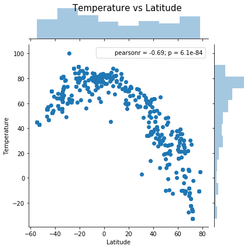
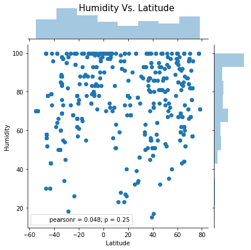
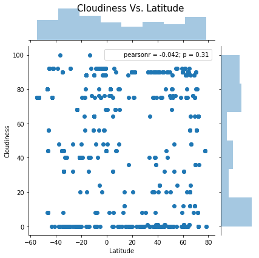
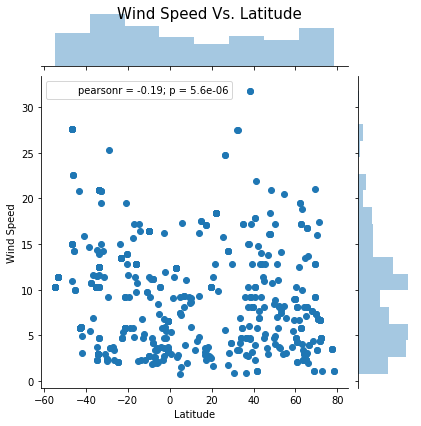

```python
import openweathermapy.core as owm

import numpy as np
import matplotlib.pyplot as plt

import pandas as pd
import random

from citipy import citipy

import requests as req
import json

import seaborn as sns

from config import owm_key
```


```python
target_num = 650 #how many cities we need

#Generate random cities
cities=[]
cities_c=[]

while (len(cities)<target_num):
    random_lat=random.uniform(-90,91)
    random_lon=random.uniform(-180,181)
    c=citipy.nearest_city(random_lat,random_lon)
    if (c.city_name not in cities):
        cities.append(c.city_name.capitalize())
        cities_c.append(c.country_code)
    
cities_df=pd.DataFrame(columns=['City','Country','Latitude','Temperature','Humidity','Cloudiness','Wind Speed'])
cities_df=cities_df.astype(dtype={'Latitude':'float64','Temperature':'float64','Humidity':'float64','Cloudiness':'float64','Wind Speed':'float64'})
cities_df['City']=cities
cities_df['Country']=cities_c
#cities_df
```


```python
#Requesting Open Weather data
url = "http://api.openweathermap.org/data/2.5/weather?"

units='imperial'

for i in range(0,len(cities_df)):
    city=cities_df.iloc[i,0]
    country=cities_df.iloc[i,1]
    
    query_url = "%sappid=%s&q=%s,%s&units=%s"%(url, owm_key, city, country, units)
    weather_response = req.get(query_url)
    #if the city isn't on OWM
    if weather_response.ok:
        weather_json = weather_response.json()
        print ("Processing "+query_url)
        print("for city of "+city+', '+country)

        cities_df.iloc[i,2]=weather_json['coord']['lat']
        cities_df.iloc[i,3]=weather_json['main']['temp']
        cities_df.iloc[i,4]=weather_json['main']['humidity']
        cities_df.iloc[i,5]=weather_json['clouds']['all']
        cities_df.iloc[i,6]=weather_json['wind']['speed']
        
#Delete rows with no data
cities_df1=cities_df.dropna(axis=0, how='any')
cities_df1
cities_df=cities_df1
cities_df

```

    Processing http://api.openweathermap.org/data/2.5/weather?appid=25bc90a1196e6f153eece0bc0b0fc9eb&q=Punta arenas,cl&units=imperial
    for city of Punta arenas, cl
    Processing http://api.openweathermap.org/data/2.5/weather?appid=25bc90a1196e6f153eece0bc0b0fc9eb&q=Busselton,au&units=imperial
    for city of Busselton, au
    Processing http://api.openweathermap.org/data/2.5/weather?appid=25bc90a1196e6f153eece0bc0b0fc9eb&q=Myaundzha,ru&units=imperial
    for city of Myaundzha, ru
    Processing http://api.openweathermap.org/data/2.5/weather?appid=25bc90a1196e6f153eece0bc0b0fc9eb&q=Kajaani,fi&units=imperial
    for city of Kajaani, fi
    Processing http://api.openweathermap.org/data/2.5/weather?appid=25bc90a1196e6f153eece0bc0b0fc9eb&q=Lebu,cl&units=imperial
    for city of Lebu, cl
    Processing http://api.openweathermap.org/data/2.5/weather?appid=25bc90a1196e6f153eece0bc0b0fc9eb&q=Kano,ng&units=imperial
    for city of Kano, ng
    Processing http://api.openweathermap.org/data/2.5/weather?appid=25bc90a1196e6f153eece0bc0b0fc9eb&q=Barquisimeto,ve&units=imperial
    for city of Barquisimeto, ve
    Processing http://api.openweathermap.org/data/2.5/weather?appid=25bc90a1196e6f153eece0bc0b0fc9eb&q=Kwaluseni,sz&units=imperial
    for city of Kwaluseni, sz
    Processing http://api.openweathermap.org/data/2.5/weather?appid=25bc90a1196e6f153eece0bc0b0fc9eb&q=Katherine,au&units=imperial
    for city of Katherine, au
    Processing http://api.openweathermap.org/data/2.5/weather?appid=25bc90a1196e6f153eece0bc0b0fc9eb&q=Qaanaaq,gl&units=imperial
    for city of Qaanaaq, gl
    Processing http://api.openweathermap.org/data/2.5/weather?appid=25bc90a1196e6f153eece0bc0b0fc9eb&q=Vaini,to&units=imperial
    for city of Vaini, to
    Processing http://api.openweathermap.org/data/2.5/weather?appid=25bc90a1196e6f153eece0bc0b0fc9eb&q=Norman wells,ca&units=imperial
    for city of Norman wells, ca
    Processing http://api.openweathermap.org/data/2.5/weather?appid=25bc90a1196e6f153eece0bc0b0fc9eb&q=Haines junction,ca&units=imperial
    for city of Haines junction, ca
    Processing http://api.openweathermap.org/data/2.5/weather?appid=25bc90a1196e6f153eece0bc0b0fc9eb&q=Busselton,au&units=imperial
    for city of Busselton, au
    Processing http://api.openweathermap.org/data/2.5/weather?appid=25bc90a1196e6f153eece0bc0b0fc9eb&q=Kurilsk,ru&units=imperial
    for city of Kurilsk, ru
    Processing http://api.openweathermap.org/data/2.5/weather?appid=25bc90a1196e6f153eece0bc0b0fc9eb&q=Mnogovershinnyy,ru&units=imperial
    for city of Mnogovershinnyy, ru
    Processing http://api.openweathermap.org/data/2.5/weather?appid=25bc90a1196e6f153eece0bc0b0fc9eb&q=Mar del plata,ar&units=imperial
    for city of Mar del plata, ar
    Processing http://api.openweathermap.org/data/2.5/weather?appid=25bc90a1196e6f153eece0bc0b0fc9eb&q=Rikitea,pf&units=imperial
    for city of Rikitea, pf
    Processing http://api.openweathermap.org/data/2.5/weather?appid=25bc90a1196e6f153eece0bc0b0fc9eb&q=Sinop,tr&units=imperial
    for city of Sinop, tr
    Processing http://api.openweathermap.org/data/2.5/weather?appid=25bc90a1196e6f153eece0bc0b0fc9eb&q=Vanimo,pg&units=imperial
    for city of Vanimo, pg
    Processing http://api.openweathermap.org/data/2.5/weather?appid=25bc90a1196e6f153eece0bc0b0fc9eb&q=Nikolskoye,ru&units=imperial
    for city of Nikolskoye, ru
    Processing http://api.openweathermap.org/data/2.5/weather?appid=25bc90a1196e6f153eece0bc0b0fc9eb&q=Bluff,nz&units=imperial
    for city of Bluff, nz
    Processing http://api.openweathermap.org/data/2.5/weather?appid=25bc90a1196e6f153eece0bc0b0fc9eb&q=Vaini,to&units=imperial
    for city of Vaini, to
    Processing http://api.openweathermap.org/data/2.5/weather?appid=25bc90a1196e6f153eece0bc0b0fc9eb&q=Torbay,ca&units=imperial
    for city of Torbay, ca
    Processing http://api.openweathermap.org/data/2.5/weather?appid=25bc90a1196e6f153eece0bc0b0fc9eb&q=Port alfred,za&units=imperial
    for city of Port alfred, za
    Processing http://api.openweathermap.org/data/2.5/weather?appid=25bc90a1196e6f153eece0bc0b0fc9eb&q=Rikitea,pf&units=imperial
    for city of Rikitea, pf
    Processing http://api.openweathermap.org/data/2.5/weather?appid=25bc90a1196e6f153eece0bc0b0fc9eb&q=Punta arenas,cl&units=imperial
    for city of Punta arenas, cl
    Processing http://api.openweathermap.org/data/2.5/weather?appid=25bc90a1196e6f153eece0bc0b0fc9eb&q=Broken hill,au&units=imperial
    for city of Broken hill, au
    Processing http://api.openweathermap.org/data/2.5/weather?appid=25bc90a1196e6f153eece0bc0b0fc9eb&q=Qasigiannguit,gl&units=imperial
    for city of Qasigiannguit, gl
    Processing http://api.openweathermap.org/data/2.5/weather?appid=25bc90a1196e6f153eece0bc0b0fc9eb&q=Cape town,za&units=imperial
    for city of Cape town, za
    Processing http://api.openweathermap.org/data/2.5/weather?appid=25bc90a1196e6f153eece0bc0b0fc9eb&q=Clyde river,ca&units=imperial
    for city of Clyde river, ca
    Processing http://api.openweathermap.org/data/2.5/weather?appid=25bc90a1196e6f153eece0bc0b0fc9eb&q=Udachnyy,ru&units=imperial
    for city of Udachnyy, ru
    Processing http://api.openweathermap.org/data/2.5/weather?appid=25bc90a1196e6f153eece0bc0b0fc9eb&q=Roald,no&units=imperial
    for city of Roald, no
    Processing http://api.openweathermap.org/data/2.5/weather?appid=25bc90a1196e6f153eece0bc0b0fc9eb&q=Busselton,au&units=imperial
    for city of Busselton, au
    Processing http://api.openweathermap.org/data/2.5/weather?appid=25bc90a1196e6f153eece0bc0b0fc9eb&q=Kulhudhuffushi,mv&units=imperial
    for city of Kulhudhuffushi, mv
    Processing http://api.openweathermap.org/data/2.5/weather?appid=25bc90a1196e6f153eece0bc0b0fc9eb&q=Atuona,pf&units=imperial
    for city of Atuona, pf
    Processing http://api.openweathermap.org/data/2.5/weather?appid=25bc90a1196e6f153eece0bc0b0fc9eb&q=Rikitea,pf&units=imperial
    for city of Rikitea, pf
    Processing http://api.openweathermap.org/data/2.5/weather?appid=25bc90a1196e6f153eece0bc0b0fc9eb&q=Rocha,uy&units=imperial
    for city of Rocha, uy
    Processing http://api.openweathermap.org/data/2.5/weather?appid=25bc90a1196e6f153eece0bc0b0fc9eb&q=Shitanjing,cn&units=imperial
    for city of Shitanjing, cn
    Processing http://api.openweathermap.org/data/2.5/weather?appid=25bc90a1196e6f153eece0bc0b0fc9eb&q=Semey,kz&units=imperial
    for city of Semey, kz
    Processing http://api.openweathermap.org/data/2.5/weather?appid=25bc90a1196e6f153eece0bc0b0fc9eb&q=Camocim,br&units=imperial
    for city of Camocim, br
    Processing http://api.openweathermap.org/data/2.5/weather?appid=25bc90a1196e6f153eece0bc0b0fc9eb&q=Ibotirama,br&units=imperial
    for city of Ibotirama, br
    Processing http://api.openweathermap.org/data/2.5/weather?appid=25bc90a1196e6f153eece0bc0b0fc9eb&q=Oranjemund,na&units=imperial
    for city of Oranjemund, na
    Processing http://api.openweathermap.org/data/2.5/weather?appid=25bc90a1196e6f153eece0bc0b0fc9eb&q=Saint-philippe,re&units=imperial
    for city of Saint-philippe, re
    Processing http://api.openweathermap.org/data/2.5/weather?appid=25bc90a1196e6f153eece0bc0b0fc9eb&q=Hearst,ca&units=imperial
    for city of Hearst, ca
    Processing http://api.openweathermap.org/data/2.5/weather?appid=25bc90a1196e6f153eece0bc0b0fc9eb&q=Mayo,ca&units=imperial
    for city of Mayo, ca
    Processing http://api.openweathermap.org/data/2.5/weather?appid=25bc90a1196e6f153eece0bc0b0fc9eb&q=Ushuaia,ar&units=imperial
    for city of Ushuaia, ar
    Processing http://api.openweathermap.org/data/2.5/weather?appid=25bc90a1196e6f153eece0bc0b0fc9eb&q=Hermanus,za&units=imperial
    for city of Hermanus, za
    Processing http://api.openweathermap.org/data/2.5/weather?appid=25bc90a1196e6f153eece0bc0b0fc9eb&q=Saint george,bm&units=imperial
    for city of Saint george, bm
    Processing http://api.openweathermap.org/data/2.5/weather?appid=25bc90a1196e6f153eece0bc0b0fc9eb&q=Wajir,ke&units=imperial
    for city of Wajir, ke
    Processing http://api.openweathermap.org/data/2.5/weather?appid=25bc90a1196e6f153eece0bc0b0fc9eb&q=Muros,es&units=imperial
    for city of Muros, es
    Processing http://api.openweathermap.org/data/2.5/weather?appid=25bc90a1196e6f153eece0bc0b0fc9eb&q=Atuona,pf&units=imperial
    for city of Atuona, pf
    Processing http://api.openweathermap.org/data/2.5/weather?appid=25bc90a1196e6f153eece0bc0b0fc9eb&q=San vicente,ph&units=imperial
    for city of San vicente, ph
    Processing http://api.openweathermap.org/data/2.5/weather?appid=25bc90a1196e6f153eece0bc0b0fc9eb&q=Hermanus,za&units=imperial
    for city of Hermanus, za
    Processing http://api.openweathermap.org/data/2.5/weather?appid=25bc90a1196e6f153eece0bc0b0fc9eb&q=Mareeba,au&units=imperial
    for city of Mareeba, au
    Processing http://api.openweathermap.org/data/2.5/weather?appid=25bc90a1196e6f153eece0bc0b0fc9eb&q=Ushuaia,ar&units=imperial
    for city of Ushuaia, ar
    Processing http://api.openweathermap.org/data/2.5/weather?appid=25bc90a1196e6f153eece0bc0b0fc9eb&q=Hermanus,za&units=imperial
    for city of Hermanus, za
    Processing http://api.openweathermap.org/data/2.5/weather?appid=25bc90a1196e6f153eece0bc0b0fc9eb&q=Ossora,ru&units=imperial
    for city of Ossora, ru
    Processing http://api.openweathermap.org/data/2.5/weather?appid=25bc90a1196e6f153eece0bc0b0fc9eb&q=Saskylakh,ru&units=imperial
    for city of Saskylakh, ru
    Processing http://api.openweathermap.org/data/2.5/weather?appid=25bc90a1196e6f153eece0bc0b0fc9eb&q=Talcahuano,cl&units=imperial
    for city of Talcahuano, cl
    Processing http://api.openweathermap.org/data/2.5/weather?appid=25bc90a1196e6f153eece0bc0b0fc9eb&q=Necochea,ar&units=imperial
    for city of Necochea, ar
    Processing http://api.openweathermap.org/data/2.5/weather?appid=25bc90a1196e6f153eece0bc0b0fc9eb&q=Eureka,us&units=imperial
    for city of Eureka, us
    Processing http://api.openweathermap.org/data/2.5/weather?appid=25bc90a1196e6f153eece0bc0b0fc9eb&q=Arcata,us&units=imperial
    for city of Arcata, us
    Processing http://api.openweathermap.org/data/2.5/weather?appid=25bc90a1196e6f153eece0bc0b0fc9eb&q=Saint-philippe,re&units=imperial
    for city of Saint-philippe, re
    Processing http://api.openweathermap.org/data/2.5/weather?appid=25bc90a1196e6f153eece0bc0b0fc9eb&q=Avarua,ck&units=imperial
    for city of Avarua, ck
    Processing http://api.openweathermap.org/data/2.5/weather?appid=25bc90a1196e6f153eece0bc0b0fc9eb&q=Yellowknife,ca&units=imperial
    for city of Yellowknife, ca
    Processing http://api.openweathermap.org/data/2.5/weather?appid=25bc90a1196e6f153eece0bc0b0fc9eb&q=Leningradskiy,ru&units=imperial
    for city of Leningradskiy, ru
    Processing http://api.openweathermap.org/data/2.5/weather?appid=25bc90a1196e6f153eece0bc0b0fc9eb&q=Caravelas,br&units=imperial
    for city of Caravelas, br
    Processing http://api.openweathermap.org/data/2.5/weather?appid=25bc90a1196e6f153eece0bc0b0fc9eb&q=Tura,ru&units=imperial
    for city of Tura, ru
    Processing http://api.openweathermap.org/data/2.5/weather?appid=25bc90a1196e6f153eece0bc0b0fc9eb&q=Bredasdorp,za&units=imperial
    for city of Bredasdorp, za
    Processing http://api.openweathermap.org/data/2.5/weather?appid=25bc90a1196e6f153eece0bc0b0fc9eb&q=Port alfred,za&units=imperial
    for city of Port alfred, za
    Processing http://api.openweathermap.org/data/2.5/weather?appid=25bc90a1196e6f153eece0bc0b0fc9eb&q=Pangnirtung,ca&units=imperial
    for city of Pangnirtung, ca
    Processing http://api.openweathermap.org/data/2.5/weather?appid=25bc90a1196e6f153eece0bc0b0fc9eb&q=Omboue,ga&units=imperial
    for city of Omboue, ga
    Processing http://api.openweathermap.org/data/2.5/weather?appid=25bc90a1196e6f153eece0bc0b0fc9eb&q=Udachnyy,ru&units=imperial
    for city of Udachnyy, ru
    Processing http://api.openweathermap.org/data/2.5/weather?appid=25bc90a1196e6f153eece0bc0b0fc9eb&q=Albany,au&units=imperial
    for city of Albany, au
    Processing http://api.openweathermap.org/data/2.5/weather?appid=25bc90a1196e6f153eece0bc0b0fc9eb&q=Westport,nz&units=imperial
    for city of Westport, nz
    Processing http://api.openweathermap.org/data/2.5/weather?appid=25bc90a1196e6f153eece0bc0b0fc9eb&q=Nemuro,jp&units=imperial
    for city of Nemuro, jp
    Processing http://api.openweathermap.org/data/2.5/weather?appid=25bc90a1196e6f153eece0bc0b0fc9eb&q=Kaitangata,nz&units=imperial
    for city of Kaitangata, nz
    Processing http://api.openweathermap.org/data/2.5/weather?appid=25bc90a1196e6f153eece0bc0b0fc9eb&q=Chokurdakh,ru&units=imperial
    for city of Chokurdakh, ru
    Processing http://api.openweathermap.org/data/2.5/weather?appid=25bc90a1196e6f153eece0bc0b0fc9eb&q=East london,za&units=imperial
    for city of East london, za
    Processing http://api.openweathermap.org/data/2.5/weather?appid=25bc90a1196e6f153eece0bc0b0fc9eb&q=Jamestown,sh&units=imperial
    for city of Jamestown, sh
    Processing http://api.openweathermap.org/data/2.5/weather?appid=25bc90a1196e6f153eece0bc0b0fc9eb&q=Ushuaia,ar&units=imperial
    for city of Ushuaia, ar
    Processing http://api.openweathermap.org/data/2.5/weather?appid=25bc90a1196e6f153eece0bc0b0fc9eb&q=Port alfred,za&units=imperial
    for city of Port alfred, za
    Processing http://api.openweathermap.org/data/2.5/weather?appid=25bc90a1196e6f153eece0bc0b0fc9eb&q=Saint-pierre,pm&units=imperial
    for city of Saint-pierre, pm
    Processing http://api.openweathermap.org/data/2.5/weather?appid=25bc90a1196e6f153eece0bc0b0fc9eb&q=Hithadhoo,mv&units=imperial
    for city of Hithadhoo, mv
    Processing http://api.openweathermap.org/data/2.5/weather?appid=25bc90a1196e6f153eece0bc0b0fc9eb&q=Hobart,au&units=imperial
    for city of Hobart, au
    Processing http://api.openweathermap.org/data/2.5/weather?appid=25bc90a1196e6f153eece0bc0b0fc9eb&q=Charleston,us&units=imperial
    for city of Charleston, us
    Processing http://api.openweathermap.org/data/2.5/weather?appid=25bc90a1196e6f153eece0bc0b0fc9eb&q=Zhuhai,cn&units=imperial
    for city of Zhuhai, cn
    Processing http://api.openweathermap.org/data/2.5/weather?appid=25bc90a1196e6f153eece0bc0b0fc9eb&q=Jamestown,sh&units=imperial
    for city of Jamestown, sh
    Processing http://api.openweathermap.org/data/2.5/weather?appid=25bc90a1196e6f153eece0bc0b0fc9eb&q=Labelle,ca&units=imperial
    for city of Labelle, ca
    Processing http://api.openweathermap.org/data/2.5/weather?appid=25bc90a1196e6f153eece0bc0b0fc9eb&q=Lujan,ar&units=imperial
    for city of Lujan, ar
    Processing http://api.openweathermap.org/data/2.5/weather?appid=25bc90a1196e6f153eece0bc0b0fc9eb&q=Norman wells,ca&units=imperial
    for city of Norman wells, ca
    Processing http://api.openweathermap.org/data/2.5/weather?appid=25bc90a1196e6f153eece0bc0b0fc9eb&q=Port lincoln,au&units=imperial
    for city of Port lincoln, au
    Processing http://api.openweathermap.org/data/2.5/weather?appid=25bc90a1196e6f153eece0bc0b0fc9eb&q=Wattegama,lk&units=imperial
    for city of Wattegama, lk
    Processing http://api.openweathermap.org/data/2.5/weather?appid=25bc90a1196e6f153eece0bc0b0fc9eb&q=Hilo,us&units=imperial
    for city of Hilo, us
    Processing http://api.openweathermap.org/data/2.5/weather?appid=25bc90a1196e6f153eece0bc0b0fc9eb&q=Yellowknife,ca&units=imperial
    for city of Yellowknife, ca
    Processing http://api.openweathermap.org/data/2.5/weather?appid=25bc90a1196e6f153eece0bc0b0fc9eb&q=Ushuaia,ar&units=imperial
    for city of Ushuaia, ar
    Processing http://api.openweathermap.org/data/2.5/weather?appid=25bc90a1196e6f153eece0bc0b0fc9eb&q=Tuktoyaktuk,ca&units=imperial
    for city of Tuktoyaktuk, ca
    Processing http://api.openweathermap.org/data/2.5/weather?appid=25bc90a1196e6f153eece0bc0b0fc9eb&q=Atuona,pf&units=imperial
    for city of Atuona, pf
    Processing http://api.openweathermap.org/data/2.5/weather?appid=25bc90a1196e6f153eece0bc0b0fc9eb&q=Hamilton,bm&units=imperial
    for city of Hamilton, bm
    Processing http://api.openweathermap.org/data/2.5/weather?appid=25bc90a1196e6f153eece0bc0b0fc9eb&q=Ushuaia,ar&units=imperial
    for city of Ushuaia, ar
    Processing http://api.openweathermap.org/data/2.5/weather?appid=25bc90a1196e6f153eece0bc0b0fc9eb&q=Fond du lac,us&units=imperial
    for city of Fond du lac, us
    Processing http://api.openweathermap.org/data/2.5/weather?appid=25bc90a1196e6f153eece0bc0b0fc9eb&q=Hakkari,tr&units=imperial
    for city of Hakkari, tr
    Processing http://api.openweathermap.org/data/2.5/weather?appid=25bc90a1196e6f153eece0bc0b0fc9eb&q=Tagusao,ph&units=imperial
    for city of Tagusao, ph
    Processing http://api.openweathermap.org/data/2.5/weather?appid=25bc90a1196e6f153eece0bc0b0fc9eb&q=Busselton,au&units=imperial
    for city of Busselton, au
    Processing http://api.openweathermap.org/data/2.5/weather?appid=25bc90a1196e6f153eece0bc0b0fc9eb&q=Maragogi,br&units=imperial
    for city of Maragogi, br
    Processing http://api.openweathermap.org/data/2.5/weather?appid=25bc90a1196e6f153eece0bc0b0fc9eb&q=Rawson,ar&units=imperial
    for city of Rawson, ar
    Processing http://api.openweathermap.org/data/2.5/weather?appid=25bc90a1196e6f153eece0bc0b0fc9eb&q=Alice springs,au&units=imperial
    for city of Alice springs, au
    Processing http://api.openweathermap.org/data/2.5/weather?appid=25bc90a1196e6f153eece0bc0b0fc9eb&q=Cabedelo,br&units=imperial
    for city of Cabedelo, br
    Processing http://api.openweathermap.org/data/2.5/weather?appid=25bc90a1196e6f153eece0bc0b0fc9eb&q=Miraflores,co&units=imperial
    for city of Miraflores, co
    Processing http://api.openweathermap.org/data/2.5/weather?appid=25bc90a1196e6f153eece0bc0b0fc9eb&q=East london,za&units=imperial
    for city of East london, za
    Processing http://api.openweathermap.org/data/2.5/weather?appid=25bc90a1196e6f153eece0bc0b0fc9eb&q=Arraial do cabo,br&units=imperial
    for city of Arraial do cabo, br
    Processing http://api.openweathermap.org/data/2.5/weather?appid=25bc90a1196e6f153eece0bc0b0fc9eb&q=Mahebourg,mu&units=imperial
    for city of Mahebourg, mu
    Processing http://api.openweathermap.org/data/2.5/weather?appid=25bc90a1196e6f153eece0bc0b0fc9eb&q=Flinders,au&units=imperial
    for city of Flinders, au
    Processing http://api.openweathermap.org/data/2.5/weather?appid=25bc90a1196e6f153eece0bc0b0fc9eb&q=Khatanga,ru&units=imperial
    for city of Khatanga, ru
    Processing http://api.openweathermap.org/data/2.5/weather?appid=25bc90a1196e6f153eece0bc0b0fc9eb&q=Dudinka,ru&units=imperial
    for city of Dudinka, ru
    Processing http://api.openweathermap.org/data/2.5/weather?appid=25bc90a1196e6f153eece0bc0b0fc9eb&q=Baghdad,iq&units=imperial
    for city of Baghdad, iq
    Processing http://api.openweathermap.org/data/2.5/weather?appid=25bc90a1196e6f153eece0bc0b0fc9eb&q=Narsaq,gl&units=imperial
    for city of Narsaq, gl
    Processing http://api.openweathermap.org/data/2.5/weather?appid=25bc90a1196e6f153eece0bc0b0fc9eb&q=Hilo,us&units=imperial
    for city of Hilo, us
    Processing http://api.openweathermap.org/data/2.5/weather?appid=25bc90a1196e6f153eece0bc0b0fc9eb&q=Cape town,za&units=imperial
    for city of Cape town, za
    Processing http://api.openweathermap.org/data/2.5/weather?appid=25bc90a1196e6f153eece0bc0b0fc9eb&q=Jamestown,sh&units=imperial
    for city of Jamestown, sh
    Processing http://api.openweathermap.org/data/2.5/weather?appid=25bc90a1196e6f153eece0bc0b0fc9eb&q=Kapaa,us&units=imperial
    for city of Kapaa, us
    Processing http://api.openweathermap.org/data/2.5/weather?appid=25bc90a1196e6f153eece0bc0b0fc9eb&q=Vaini,to&units=imperial
    for city of Vaini, to
    Processing http://api.openweathermap.org/data/2.5/weather?appid=25bc90a1196e6f153eece0bc0b0fc9eb&q=Ribeira grande,pt&units=imperial
    for city of Ribeira grande, pt
    Processing http://api.openweathermap.org/data/2.5/weather?appid=25bc90a1196e6f153eece0bc0b0fc9eb&q=Isangel,vu&units=imperial
    for city of Isangel, vu
    Processing http://api.openweathermap.org/data/2.5/weather?appid=25bc90a1196e6f153eece0bc0b0fc9eb&q=Bhadasar,in&units=imperial
    for city of Bhadasar, in
    Processing http://api.openweathermap.org/data/2.5/weather?appid=25bc90a1196e6f153eece0bc0b0fc9eb&q=Hobart,au&units=imperial
    for city of Hobart, au
    Processing http://api.openweathermap.org/data/2.5/weather?appid=25bc90a1196e6f153eece0bc0b0fc9eb&q=Fenoarivo,mg&units=imperial
    for city of Fenoarivo, mg
    Processing http://api.openweathermap.org/data/2.5/weather?appid=25bc90a1196e6f153eece0bc0b0fc9eb&q=Pevek,ru&units=imperial
    for city of Pevek, ru
    Processing http://api.openweathermap.org/data/2.5/weather?appid=25bc90a1196e6f153eece0bc0b0fc9eb&q=Huarmey,pe&units=imperial
    for city of Huarmey, pe
    Processing http://api.openweathermap.org/data/2.5/weather?appid=25bc90a1196e6f153eece0bc0b0fc9eb&q=Sao filipe,cv&units=imperial
    for city of Sao filipe, cv
    Processing http://api.openweathermap.org/data/2.5/weather?appid=25bc90a1196e6f153eece0bc0b0fc9eb&q=Maceio,br&units=imperial
    for city of Maceio, br
    Processing http://api.openweathermap.org/data/2.5/weather?appid=25bc90a1196e6f153eece0bc0b0fc9eb&q=Makokou,ga&units=imperial
    for city of Makokou, ga
    Processing http://api.openweathermap.org/data/2.5/weather?appid=25bc90a1196e6f153eece0bc0b0fc9eb&q=Port lincoln,au&units=imperial
    for city of Port lincoln, au
    Processing http://api.openweathermap.org/data/2.5/weather?appid=25bc90a1196e6f153eece0bc0b0fc9eb&q=Luderitz,na&units=imperial
    for city of Luderitz, na
    Processing http://api.openweathermap.org/data/2.5/weather?appid=25bc90a1196e6f153eece0bc0b0fc9eb&q=Katangli,ru&units=imperial
    for city of Katangli, ru
    Processing http://api.openweathermap.org/data/2.5/weather?appid=25bc90a1196e6f153eece0bc0b0fc9eb&q=Puerto ayora,ec&units=imperial
    for city of Puerto ayora, ec
    Processing http://api.openweathermap.org/data/2.5/weather?appid=25bc90a1196e6f153eece0bc0b0fc9eb&q=Ushuaia,ar&units=imperial
    for city of Ushuaia, ar
    Processing http://api.openweathermap.org/data/2.5/weather?appid=25bc90a1196e6f153eece0bc0b0fc9eb&q=Bluff,nz&units=imperial
    for city of Bluff, nz
    Processing http://api.openweathermap.org/data/2.5/weather?appid=25bc90a1196e6f153eece0bc0b0fc9eb&q=Tuktoyaktuk,ca&units=imperial
    for city of Tuktoyaktuk, ca
    Processing http://api.openweathermap.org/data/2.5/weather?appid=25bc90a1196e6f153eece0bc0b0fc9eb&q=Bay roberts,ca&units=imperial
    for city of Bay roberts, ca
    Processing http://api.openweathermap.org/data/2.5/weather?appid=25bc90a1196e6f153eece0bc0b0fc9eb&q=Georgetown,sh&units=imperial
    for city of Georgetown, sh
    Processing http://api.openweathermap.org/data/2.5/weather?appid=25bc90a1196e6f153eece0bc0b0fc9eb&q=Mar del plata,ar&units=imperial
    for city of Mar del plata, ar
    Processing http://api.openweathermap.org/data/2.5/weather?appid=25bc90a1196e6f153eece0bc0b0fc9eb&q=San rafael,ar&units=imperial
    for city of San rafael, ar
    Processing http://api.openweathermap.org/data/2.5/weather?appid=25bc90a1196e6f153eece0bc0b0fc9eb&q=Korla,cn&units=imperial
    for city of Korla, cn
    Processing http://api.openweathermap.org/data/2.5/weather?appid=25bc90a1196e6f153eece0bc0b0fc9eb&q=Mogadishu,so&units=imperial
    for city of Mogadishu, so
    Processing http://api.openweathermap.org/data/2.5/weather?appid=25bc90a1196e6f153eece0bc0b0fc9eb&q=Hami,cn&units=imperial
    for city of Hami, cn
    Processing http://api.openweathermap.org/data/2.5/weather?appid=25bc90a1196e6f153eece0bc0b0fc9eb&q=Angoche,mz&units=imperial
    for city of Angoche, mz
    Processing http://api.openweathermap.org/data/2.5/weather?appid=25bc90a1196e6f153eece0bc0b0fc9eb&q=Albany,au&units=imperial
    for city of Albany, au
    Processing http://api.openweathermap.org/data/2.5/weather?appid=25bc90a1196e6f153eece0bc0b0fc9eb&q=Ushuaia,ar&units=imperial
    for city of Ushuaia, ar
    Processing http://api.openweathermap.org/data/2.5/weather?appid=25bc90a1196e6f153eece0bc0b0fc9eb&q=Carnarvon,za&units=imperial
    for city of Carnarvon, za
    Processing http://api.openweathermap.org/data/2.5/weather?appid=25bc90a1196e6f153eece0bc0b0fc9eb&q=Norman wells,ca&units=imperial
    for city of Norman wells, ca
    Processing http://api.openweathermap.org/data/2.5/weather?appid=25bc90a1196e6f153eece0bc0b0fc9eb&q=Bethel,us&units=imperial
    for city of Bethel, us
    Processing http://api.openweathermap.org/data/2.5/weather?appid=25bc90a1196e6f153eece0bc0b0fc9eb&q=Hudiksvall,se&units=imperial
    for city of Hudiksvall, se
    Processing http://api.openweathermap.org/data/2.5/weather?appid=25bc90a1196e6f153eece0bc0b0fc9eb&q=Poli,cm&units=imperial
    for city of Poli, cm
    Processing http://api.openweathermap.org/data/2.5/weather?appid=25bc90a1196e6f153eece0bc0b0fc9eb&q=Kieta,pg&units=imperial
    for city of Kieta, pg
    Processing http://api.openweathermap.org/data/2.5/weather?appid=25bc90a1196e6f153eece0bc0b0fc9eb&q=Cidreira,br&units=imperial
    for city of Cidreira, br
    Processing http://api.openweathermap.org/data/2.5/weather?appid=25bc90a1196e6f153eece0bc0b0fc9eb&q=Kapaa,us&units=imperial
    for city of Kapaa, us
    Processing http://api.openweathermap.org/data/2.5/weather?appid=25bc90a1196e6f153eece0bc0b0fc9eb&q=Iqaluit,ca&units=imperial
    for city of Iqaluit, ca
    Processing http://api.openweathermap.org/data/2.5/weather?appid=25bc90a1196e6f153eece0bc0b0fc9eb&q=Jamestown,sh&units=imperial
    for city of Jamestown, sh
    Processing http://api.openweathermap.org/data/2.5/weather?appid=25bc90a1196e6f153eece0bc0b0fc9eb&q=Katsuura,jp&units=imperial
    for city of Katsuura, jp
    Processing http://api.openweathermap.org/data/2.5/weather?appid=25bc90a1196e6f153eece0bc0b0fc9eb&q=Upernavik,gl&units=imperial
    for city of Upernavik, gl
    Processing http://api.openweathermap.org/data/2.5/weather?appid=25bc90a1196e6f153eece0bc0b0fc9eb&q=Matamoros,mx&units=imperial
    for city of Matamoros, mx
    Processing http://api.openweathermap.org/data/2.5/weather?appid=25bc90a1196e6f153eece0bc0b0fc9eb&q=Albany,au&units=imperial
    for city of Albany, au
    Processing http://api.openweathermap.org/data/2.5/weather?appid=25bc90a1196e6f153eece0bc0b0fc9eb&q=Victoria,sc&units=imperial
    for city of Victoria, sc
    Processing http://api.openweathermap.org/data/2.5/weather?appid=25bc90a1196e6f153eece0bc0b0fc9eb&q=Boueni,yt&units=imperial
    for city of Boueni, yt
    Processing http://api.openweathermap.org/data/2.5/weather?appid=25bc90a1196e6f153eece0bc0b0fc9eb&q=Mar del plata,ar&units=imperial
    for city of Mar del plata, ar
    Processing http://api.openweathermap.org/data/2.5/weather?appid=25bc90a1196e6f153eece0bc0b0fc9eb&q=Mae hong son,th&units=imperial
    for city of Mae hong son, th
    Processing http://api.openweathermap.org/data/2.5/weather?appid=25bc90a1196e6f153eece0bc0b0fc9eb&q=Puerto ayora,ec&units=imperial
    for city of Puerto ayora, ec
    Processing http://api.openweathermap.org/data/2.5/weather?appid=25bc90a1196e6f153eece0bc0b0fc9eb&q=Merauke,id&units=imperial
    for city of Merauke, id
    Processing http://api.openweathermap.org/data/2.5/weather?appid=25bc90a1196e6f153eece0bc0b0fc9eb&q=Bethel,us&units=imperial
    for city of Bethel, us
    Processing http://api.openweathermap.org/data/2.5/weather?appid=25bc90a1196e6f153eece0bc0b0fc9eb&q=Albany,au&units=imperial
    for city of Albany, au
    Processing http://api.openweathermap.org/data/2.5/weather?appid=25bc90a1196e6f153eece0bc0b0fc9eb&q=Korla,cn&units=imperial
    for city of Korla, cn
    Processing http://api.openweathermap.org/data/2.5/weather?appid=25bc90a1196e6f153eece0bc0b0fc9eb&q=Lozova,ua&units=imperial
    for city of Lozova, ua
    Processing http://api.openweathermap.org/data/2.5/weather?appid=25bc90a1196e6f153eece0bc0b0fc9eb&q=Arraial do cabo,br&units=imperial
    for city of Arraial do cabo, br
    Processing http://api.openweathermap.org/data/2.5/weather?appid=25bc90a1196e6f153eece0bc0b0fc9eb&q=Ushuaia,ar&units=imperial
    for city of Ushuaia, ar
    Processing http://api.openweathermap.org/data/2.5/weather?appid=25bc90a1196e6f153eece0bc0b0fc9eb&q=Kachkanar,ru&units=imperial
    for city of Kachkanar, ru
    Processing http://api.openweathermap.org/data/2.5/weather?appid=25bc90a1196e6f153eece0bc0b0fc9eb&q=Shelburne,ca&units=imperial
    for city of Shelburne, ca
    Processing http://api.openweathermap.org/data/2.5/weather?appid=25bc90a1196e6f153eece0bc0b0fc9eb&q=Algiers,dz&units=imperial
    for city of Algiers, dz
    Processing http://api.openweathermap.org/data/2.5/weather?appid=25bc90a1196e6f153eece0bc0b0fc9eb&q=Fuglebjerg,dk&units=imperial
    for city of Fuglebjerg, dk
    Processing http://api.openweathermap.org/data/2.5/weather?appid=25bc90a1196e6f153eece0bc0b0fc9eb&q=Torbay,ca&units=imperial
    for city of Torbay, ca
    Processing http://api.openweathermap.org/data/2.5/weather?appid=25bc90a1196e6f153eece0bc0b0fc9eb&q=Tiksi,ru&units=imperial
    for city of Tiksi, ru
    Processing http://api.openweathermap.org/data/2.5/weather?appid=25bc90a1196e6f153eece0bc0b0fc9eb&q=Attock,pk&units=imperial
    for city of Attock, pk
    Processing http://api.openweathermap.org/data/2.5/weather?appid=25bc90a1196e6f153eece0bc0b0fc9eb&q=Jamestown,sh&units=imperial
    for city of Jamestown, sh
    Processing http://api.openweathermap.org/data/2.5/weather?appid=25bc90a1196e6f153eece0bc0b0fc9eb&q=Clyde river,ca&units=imperial
    for city of Clyde river, ca
    Processing http://api.openweathermap.org/data/2.5/weather?appid=25bc90a1196e6f153eece0bc0b0fc9eb&q=Rikitea,pf&units=imperial
    for city of Rikitea, pf
    Processing http://api.openweathermap.org/data/2.5/weather?appid=25bc90a1196e6f153eece0bc0b0fc9eb&q=Samarai,pg&units=imperial
    for city of Samarai, pg
    Processing http://api.openweathermap.org/data/2.5/weather?appid=25bc90a1196e6f153eece0bc0b0fc9eb&q=Mwinilunga,zm&units=imperial
    for city of Mwinilunga, zm
    Processing http://api.openweathermap.org/data/2.5/weather?appid=25bc90a1196e6f153eece0bc0b0fc9eb&q=Rabo de peixe,pt&units=imperial
    for city of Rabo de peixe, pt
    Processing http://api.openweathermap.org/data/2.5/weather?appid=25bc90a1196e6f153eece0bc0b0fc9eb&q=Arraial do cabo,br&units=imperial
    for city of Arraial do cabo, br
    Processing http://api.openweathermap.org/data/2.5/weather?appid=25bc90a1196e6f153eece0bc0b0fc9eb&q=Punta arenas,cl&units=imperial
    for city of Punta arenas, cl
    Processing http://api.openweathermap.org/data/2.5/weather?appid=25bc90a1196e6f153eece0bc0b0fc9eb&q=Whyalla,au&units=imperial
    for city of Whyalla, au
    Processing http://api.openweathermap.org/data/2.5/weather?appid=25bc90a1196e6f153eece0bc0b0fc9eb&q=Nantucket,us&units=imperial
    for city of Nantucket, us
    Processing http://api.openweathermap.org/data/2.5/weather?appid=25bc90a1196e6f153eece0bc0b0fc9eb&q=Fortuna,us&units=imperial
    for city of Fortuna, us
    Processing http://api.openweathermap.org/data/2.5/weather?appid=25bc90a1196e6f153eece0bc0b0fc9eb&q=Punta arenas,cl&units=imperial
    for city of Punta arenas, cl
    Processing http://api.openweathermap.org/data/2.5/weather?appid=25bc90a1196e6f153eece0bc0b0fc9eb&q=Loei,th&units=imperial
    for city of Loei, th
    Processing http://api.openweathermap.org/data/2.5/weather?appid=25bc90a1196e6f153eece0bc0b0fc9eb&q=Nola,cf&units=imperial
    for city of Nola, cf
    Processing http://api.openweathermap.org/data/2.5/weather?appid=25bc90a1196e6f153eece0bc0b0fc9eb&q=Barrow,us&units=imperial
    for city of Barrow, us
    Processing http://api.openweathermap.org/data/2.5/weather?appid=25bc90a1196e6f153eece0bc0b0fc9eb&q=Khatanga,ru&units=imperial
    for city of Khatanga, ru
    Processing http://api.openweathermap.org/data/2.5/weather?appid=25bc90a1196e6f153eece0bc0b0fc9eb&q=Albany,au&units=imperial
    for city of Albany, au
    Processing http://api.openweathermap.org/data/2.5/weather?appid=25bc90a1196e6f153eece0bc0b0fc9eb&q=Balkhash,kz&units=imperial
    for city of Balkhash, kz
    Processing http://api.openweathermap.org/data/2.5/weather?appid=25bc90a1196e6f153eece0bc0b0fc9eb&q=Nata,bw&units=imperial
    for city of Nata, bw
    Processing http://api.openweathermap.org/data/2.5/weather?appid=25bc90a1196e6f153eece0bc0b0fc9eb&q=Mehamn,no&units=imperial
    for city of Mehamn, no
    Processing http://api.openweathermap.org/data/2.5/weather?appid=25bc90a1196e6f153eece0bc0b0fc9eb&q=Borovoy,ru&units=imperial
    for city of Borovoy, ru
    Processing http://api.openweathermap.org/data/2.5/weather?appid=25bc90a1196e6f153eece0bc0b0fc9eb&q=San jose,gt&units=imperial
    for city of San jose, gt
    Processing http://api.openweathermap.org/data/2.5/weather?appid=25bc90a1196e6f153eece0bc0b0fc9eb&q=Guerrero negro,mx&units=imperial
    for city of Guerrero negro, mx
    Processing http://api.openweathermap.org/data/2.5/weather?appid=25bc90a1196e6f153eece0bc0b0fc9eb&q=Ribeira grande,pt&units=imperial
    for city of Ribeira grande, pt
    Processing http://api.openweathermap.org/data/2.5/weather?appid=25bc90a1196e6f153eece0bc0b0fc9eb&q=Godfrey,us&units=imperial
    for city of Godfrey, us
    Processing http://api.openweathermap.org/data/2.5/weather?appid=25bc90a1196e6f153eece0bc0b0fc9eb&q=Butaritari,ki&units=imperial
    for city of Butaritari, ki
    Processing http://api.openweathermap.org/data/2.5/weather?appid=25bc90a1196e6f153eece0bc0b0fc9eb&q=Hermanus,za&units=imperial
    for city of Hermanus, za
    Processing http://api.openweathermap.org/data/2.5/weather?appid=25bc90a1196e6f153eece0bc0b0fc9eb&q=Khilok,ru&units=imperial
    for city of Khilok, ru
    Processing http://api.openweathermap.org/data/2.5/weather?appid=25bc90a1196e6f153eece0bc0b0fc9eb&q=Ushuaia,ar&units=imperial
    for city of Ushuaia, ar
    Processing http://api.openweathermap.org/data/2.5/weather?appid=25bc90a1196e6f153eece0bc0b0fc9eb&q=Haines junction,ca&units=imperial
    for city of Haines junction, ca
    Processing http://api.openweathermap.org/data/2.5/weather?appid=25bc90a1196e6f153eece0bc0b0fc9eb&q=Kodiak,us&units=imperial
    for city of Kodiak, us
    Processing http://api.openweathermap.org/data/2.5/weather?appid=25bc90a1196e6f153eece0bc0b0fc9eb&q=Najran,sa&units=imperial
    for city of Najran, sa
    Processing http://api.openweathermap.org/data/2.5/weather?appid=25bc90a1196e6f153eece0bc0b0fc9eb&q=Mar del plata,ar&units=imperial
    for city of Mar del plata, ar
    Processing http://api.openweathermap.org/data/2.5/weather?appid=25bc90a1196e6f153eece0bc0b0fc9eb&q=Bambanglipuro,id&units=imperial
    for city of Bambanglipuro, id
    Processing http://api.openweathermap.org/data/2.5/weather?appid=25bc90a1196e6f153eece0bc0b0fc9eb&q=Bambous virieux,mu&units=imperial
    for city of Bambous virieux, mu
    Processing http://api.openweathermap.org/data/2.5/weather?appid=25bc90a1196e6f153eece0bc0b0fc9eb&q=Punta arenas,cl&units=imperial
    for city of Punta arenas, cl
    Processing http://api.openweathermap.org/data/2.5/weather?appid=25bc90a1196e6f153eece0bc0b0fc9eb&q=Busselton,au&units=imperial
    for city of Busselton, au
    Processing http://api.openweathermap.org/data/2.5/weather?appid=25bc90a1196e6f153eece0bc0b0fc9eb&q=Rikitea,pf&units=imperial
    for city of Rikitea, pf
    Processing http://api.openweathermap.org/data/2.5/weather?appid=25bc90a1196e6f153eece0bc0b0fc9eb&q=Durban,za&units=imperial
    for city of Durban, za
    Processing http://api.openweathermap.org/data/2.5/weather?appid=25bc90a1196e6f153eece0bc0b0fc9eb&q=Tomatlan,mx&units=imperial
    for city of Tomatlan, mx
    Processing http://api.openweathermap.org/data/2.5/weather?appid=25bc90a1196e6f153eece0bc0b0fc9eb&q=Tankhoy,ru&units=imperial
    for city of Tankhoy, ru
    Processing http://api.openweathermap.org/data/2.5/weather?appid=25bc90a1196e6f153eece0bc0b0fc9eb&q=Guerrero negro,mx&units=imperial
    for city of Guerrero negro, mx
    Processing http://api.openweathermap.org/data/2.5/weather?appid=25bc90a1196e6f153eece0bc0b0fc9eb&q=Albany,au&units=imperial
    for city of Albany, au
    Processing http://api.openweathermap.org/data/2.5/weather?appid=25bc90a1196e6f153eece0bc0b0fc9eb&q=Castro,cl&units=imperial
    for city of Castro, cl
    Processing http://api.openweathermap.org/data/2.5/weather?appid=25bc90a1196e6f153eece0bc0b0fc9eb&q=Atuona,pf&units=imperial
    for city of Atuona, pf
    Processing http://api.openweathermap.org/data/2.5/weather?appid=25bc90a1196e6f153eece0bc0b0fc9eb&q=Kloulklubed,pw&units=imperial
    for city of Kloulklubed, pw
    Processing http://api.openweathermap.org/data/2.5/weather?appid=25bc90a1196e6f153eece0bc0b0fc9eb&q=Mashhad,ir&units=imperial
    for city of Mashhad, ir
    Processing http://api.openweathermap.org/data/2.5/weather?appid=25bc90a1196e6f153eece0bc0b0fc9eb&q=Rikitea,pf&units=imperial
    for city of Rikitea, pf
    Processing http://api.openweathermap.org/data/2.5/weather?appid=25bc90a1196e6f153eece0bc0b0fc9eb&q=Kahului,us&units=imperial
    for city of Kahului, us
    Processing http://api.openweathermap.org/data/2.5/weather?appid=25bc90a1196e6f153eece0bc0b0fc9eb&q=Pevek,ru&units=imperial
    for city of Pevek, ru
    Processing http://api.openweathermap.org/data/2.5/weather?appid=25bc90a1196e6f153eece0bc0b0fc9eb&q=Oranjemund,na&units=imperial
    for city of Oranjemund, na
    Processing http://api.openweathermap.org/data/2.5/weather?appid=25bc90a1196e6f153eece0bc0b0fc9eb&q=Labuhan,id&units=imperial
    for city of Labuhan, id
    Processing http://api.openweathermap.org/data/2.5/weather?appid=25bc90a1196e6f153eece0bc0b0fc9eb&q=Takoradi,gh&units=imperial
    for city of Takoradi, gh
    Processing http://api.openweathermap.org/data/2.5/weather?appid=25bc90a1196e6f153eece0bc0b0fc9eb&q=Azul,ar&units=imperial
    for city of Azul, ar
    Processing http://api.openweathermap.org/data/2.5/weather?appid=25bc90a1196e6f153eece0bc0b0fc9eb&q=Shache,cn&units=imperial
    for city of Shache, cn
    Processing http://api.openweathermap.org/data/2.5/weather?appid=25bc90a1196e6f153eece0bc0b0fc9eb&q=Tongliao,cn&units=imperial
    for city of Tongliao, cn
    Processing http://api.openweathermap.org/data/2.5/weather?appid=25bc90a1196e6f153eece0bc0b0fc9eb&q=Sarstedt,de&units=imperial
    for city of Sarstedt, de
    Processing http://api.openweathermap.org/data/2.5/weather?appid=25bc90a1196e6f153eece0bc0b0fc9eb&q=Montepuez,mz&units=imperial
    for city of Montepuez, mz
    Processing http://api.openweathermap.org/data/2.5/weather?appid=25bc90a1196e6f153eece0bc0b0fc9eb&q=Khatanga,ru&units=imperial
    for city of Khatanga, ru
    Processing http://api.openweathermap.org/data/2.5/weather?appid=25bc90a1196e6f153eece0bc0b0fc9eb&q=Padang,id&units=imperial
    for city of Padang, id
    Processing http://api.openweathermap.org/data/2.5/weather?appid=25bc90a1196e6f153eece0bc0b0fc9eb&q=Butaritari,ki&units=imperial
    for city of Butaritari, ki
    Processing http://api.openweathermap.org/data/2.5/weather?appid=25bc90a1196e6f153eece0bc0b0fc9eb&q=Havelock,us&units=imperial
    for city of Havelock, us
    Processing http://api.openweathermap.org/data/2.5/weather?appid=25bc90a1196e6f153eece0bc0b0fc9eb&q=Lebu,cl&units=imperial
    for city of Lebu, cl
    Processing http://api.openweathermap.org/data/2.5/weather?appid=25bc90a1196e6f153eece0bc0b0fc9eb&q=Punta arenas,cl&units=imperial
    for city of Punta arenas, cl
    Processing http://api.openweathermap.org/data/2.5/weather?appid=25bc90a1196e6f153eece0bc0b0fc9eb&q=Atuona,pf&units=imperial
    for city of Atuona, pf
    Processing http://api.openweathermap.org/data/2.5/weather?appid=25bc90a1196e6f153eece0bc0b0fc9eb&q=Belmonte,br&units=imperial
    for city of Belmonte, br
    Processing http://api.openweathermap.org/data/2.5/weather?appid=25bc90a1196e6f153eece0bc0b0fc9eb&q=Butaritari,ki&units=imperial
    for city of Butaritari, ki
    Processing http://api.openweathermap.org/data/2.5/weather?appid=25bc90a1196e6f153eece0bc0b0fc9eb&q=Narsaq,gl&units=imperial
    for city of Narsaq, gl
    Processing http://api.openweathermap.org/data/2.5/weather?appid=25bc90a1196e6f153eece0bc0b0fc9eb&q=Waitati,nz&units=imperial
    for city of Waitati, nz
    Processing http://api.openweathermap.org/data/2.5/weather?appid=25bc90a1196e6f153eece0bc0b0fc9eb&q=Tuktoyaktuk,ca&units=imperial
    for city of Tuktoyaktuk, ca
    Processing http://api.openweathermap.org/data/2.5/weather?appid=25bc90a1196e6f153eece0bc0b0fc9eb&q=Rikitea,pf&units=imperial
    for city of Rikitea, pf
    Processing http://api.openweathermap.org/data/2.5/weather?appid=25bc90a1196e6f153eece0bc0b0fc9eb&q=Hobart,au&units=imperial
    for city of Hobart, au
    Processing http://api.openweathermap.org/data/2.5/weather?appid=25bc90a1196e6f153eece0bc0b0fc9eb&q=Denpasar,id&units=imperial
    for city of Denpasar, id
    Processing http://api.openweathermap.org/data/2.5/weather?appid=25bc90a1196e6f153eece0bc0b0fc9eb&q=Mahebourg,mu&units=imperial
    for city of Mahebourg, mu
    Processing http://api.openweathermap.org/data/2.5/weather?appid=25bc90a1196e6f153eece0bc0b0fc9eb&q=Bucerias,mx&units=imperial
    for city of Bucerias, mx
    Processing http://api.openweathermap.org/data/2.5/weather?appid=25bc90a1196e6f153eece0bc0b0fc9eb&q=Tasiilaq,gl&units=imperial
    for city of Tasiilaq, gl
    Processing http://api.openweathermap.org/data/2.5/weather?appid=25bc90a1196e6f153eece0bc0b0fc9eb&q=Saskylakh,ru&units=imperial
    for city of Saskylakh, ru
    Processing http://api.openweathermap.org/data/2.5/weather?appid=25bc90a1196e6f153eece0bc0b0fc9eb&q=Geraldton,au&units=imperial
    for city of Geraldton, au
    Processing http://api.openweathermap.org/data/2.5/weather?appid=25bc90a1196e6f153eece0bc0b0fc9eb&q=Ushuaia,ar&units=imperial
    for city of Ushuaia, ar
    Processing http://api.openweathermap.org/data/2.5/weather?appid=25bc90a1196e6f153eece0bc0b0fc9eb&q=Tra vinh,vn&units=imperial
    for city of Tra vinh, vn
    Processing http://api.openweathermap.org/data/2.5/weather?appid=25bc90a1196e6f153eece0bc0b0fc9eb&q=Busselton,au&units=imperial
    for city of Busselton, au
    Processing http://api.openweathermap.org/data/2.5/weather?appid=25bc90a1196e6f153eece0bc0b0fc9eb&q=Qaanaaq,gl&units=imperial
    for city of Qaanaaq, gl
    Processing http://api.openweathermap.org/data/2.5/weather?appid=25bc90a1196e6f153eece0bc0b0fc9eb&q=Vaini,to&units=imperial
    for city of Vaini, to
    Processing http://api.openweathermap.org/data/2.5/weather?appid=25bc90a1196e6f153eece0bc0b0fc9eb&q=Jamestown,sh&units=imperial
    for city of Jamestown, sh
    Processing http://api.openweathermap.org/data/2.5/weather?appid=25bc90a1196e6f153eece0bc0b0fc9eb&q=Xichang,cn&units=imperial
    for city of Xichang, cn
    Processing http://api.openweathermap.org/data/2.5/weather?appid=25bc90a1196e6f153eece0bc0b0fc9eb&q=Te anau,nz&units=imperial
    for city of Te anau, nz
    Processing http://api.openweathermap.org/data/2.5/weather?appid=25bc90a1196e6f153eece0bc0b0fc9eb&q=Te anau,nz&units=imperial
    for city of Te anau, nz
    Processing http://api.openweathermap.org/data/2.5/weather?appid=25bc90a1196e6f153eece0bc0b0fc9eb&q=Takoradi,gh&units=imperial
    for city of Takoradi, gh
    Processing http://api.openweathermap.org/data/2.5/weather?appid=25bc90a1196e6f153eece0bc0b0fc9eb&q=Peravurani,in&units=imperial
    for city of Peravurani, in
    Processing http://api.openweathermap.org/data/2.5/weather?appid=25bc90a1196e6f153eece0bc0b0fc9eb&q=Tura,ru&units=imperial
    for city of Tura, ru
    Processing http://api.openweathermap.org/data/2.5/weather?appid=25bc90a1196e6f153eece0bc0b0fc9eb&q=Cape town,za&units=imperial
    for city of Cape town, za
    Processing http://api.openweathermap.org/data/2.5/weather?appid=25bc90a1196e6f153eece0bc0b0fc9eb&q=Atuona,pf&units=imperial
    for city of Atuona, pf
    Processing http://api.openweathermap.org/data/2.5/weather?appid=25bc90a1196e6f153eece0bc0b0fc9eb&q=Carnarvon,au&units=imperial
    for city of Carnarvon, au
    Processing http://api.openweathermap.org/data/2.5/weather?appid=25bc90a1196e6f153eece0bc0b0fc9eb&q=Kodiak,us&units=imperial
    for city of Kodiak, us
    Processing http://api.openweathermap.org/data/2.5/weather?appid=25bc90a1196e6f153eece0bc0b0fc9eb&q=Ushuaia,ar&units=imperial
    for city of Ushuaia, ar
    Processing http://api.openweathermap.org/data/2.5/weather?appid=25bc90a1196e6f153eece0bc0b0fc9eb&q=Bambanglipuro,id&units=imperial
    for city of Bambanglipuro, id
    Processing http://api.openweathermap.org/data/2.5/weather?appid=25bc90a1196e6f153eece0bc0b0fc9eb&q=Busselton,au&units=imperial
    for city of Busselton, au
    Processing http://api.openweathermap.org/data/2.5/weather?appid=25bc90a1196e6f153eece0bc0b0fc9eb&q=Atuona,pf&units=imperial
    for city of Atuona, pf
    Processing http://api.openweathermap.org/data/2.5/weather?appid=25bc90a1196e6f153eece0bc0b0fc9eb&q=Honiara,sb&units=imperial
    for city of Honiara, sb
    Processing http://api.openweathermap.org/data/2.5/weather?appid=25bc90a1196e6f153eece0bc0b0fc9eb&q=Fleet,gb&units=imperial
    for city of Fleet, gb
    Processing http://api.openweathermap.org/data/2.5/weather?appid=25bc90a1196e6f153eece0bc0b0fc9eb&q=Albany,au&units=imperial
    for city of Albany, au
    Processing http://api.openweathermap.org/data/2.5/weather?appid=25bc90a1196e6f153eece0bc0b0fc9eb&q=Jalalpur pirwala,pk&units=imperial
    for city of Jalalpur pirwala, pk
    Processing http://api.openweathermap.org/data/2.5/weather?appid=25bc90a1196e6f153eece0bc0b0fc9eb&q=Rikitea,pf&units=imperial
    for city of Rikitea, pf
    Processing http://api.openweathermap.org/data/2.5/weather?appid=25bc90a1196e6f153eece0bc0b0fc9eb&q=New norfolk,au&units=imperial
    for city of New norfolk, au
    Processing http://api.openweathermap.org/data/2.5/weather?appid=25bc90a1196e6f153eece0bc0b0fc9eb&q=Vaini,to&units=imperial
    for city of Vaini, to
    Processing http://api.openweathermap.org/data/2.5/weather?appid=25bc90a1196e6f153eece0bc0b0fc9eb&q=Klaksvik,fo&units=imperial
    for city of Klaksvik, fo
    Processing http://api.openweathermap.org/data/2.5/weather?appid=25bc90a1196e6f153eece0bc0b0fc9eb&q=Busselton,au&units=imperial
    for city of Busselton, au
    Processing http://api.openweathermap.org/data/2.5/weather?appid=25bc90a1196e6f153eece0bc0b0fc9eb&q=Belaya gora,ru&units=imperial
    for city of Belaya gora, ru
    Processing http://api.openweathermap.org/data/2.5/weather?appid=25bc90a1196e6f153eece0bc0b0fc9eb&q=Ushuaia,ar&units=imperial
    for city of Ushuaia, ar
    Processing http://api.openweathermap.org/data/2.5/weather?appid=25bc90a1196e6f153eece0bc0b0fc9eb&q=Kabo,cf&units=imperial
    for city of Kabo, cf
    Processing http://api.openweathermap.org/data/2.5/weather?appid=25bc90a1196e6f153eece0bc0b0fc9eb&q=Albany,au&units=imperial
    for city of Albany, au
    Processing http://api.openweathermap.org/data/2.5/weather?appid=25bc90a1196e6f153eece0bc0b0fc9eb&q=Hobart,au&units=imperial
    for city of Hobart, au
    Processing http://api.openweathermap.org/data/2.5/weather?appid=25bc90a1196e6f153eece0bc0b0fc9eb&q=Kaitangata,nz&units=imperial
    for city of Kaitangata, nz
    Processing http://api.openweathermap.org/data/2.5/weather?appid=25bc90a1196e6f153eece0bc0b0fc9eb&q=Vaini,to&units=imperial
    for city of Vaini, to
    Processing http://api.openweathermap.org/data/2.5/weather?appid=25bc90a1196e6f153eece0bc0b0fc9eb&q=Sobolevo,ru&units=imperial
    for city of Sobolevo, ru
    Processing http://api.openweathermap.org/data/2.5/weather?appid=25bc90a1196e6f153eece0bc0b0fc9eb&q=High level,ca&units=imperial
    for city of High level, ca
    Processing http://api.openweathermap.org/data/2.5/weather?appid=25bc90a1196e6f153eece0bc0b0fc9eb&q=Roald,no&units=imperial
    for city of Roald, no
    Processing http://api.openweathermap.org/data/2.5/weather?appid=25bc90a1196e6f153eece0bc0b0fc9eb&q=Puerto ayora,ec&units=imperial
    for city of Puerto ayora, ec
    Processing http://api.openweathermap.org/data/2.5/weather?appid=25bc90a1196e6f153eece0bc0b0fc9eb&q=Saint-philippe,re&units=imperial
    for city of Saint-philippe, re
    Processing http://api.openweathermap.org/data/2.5/weather?appid=25bc90a1196e6f153eece0bc0b0fc9eb&q=Saint-philippe,re&units=imperial
    for city of Saint-philippe, re
    Processing http://api.openweathermap.org/data/2.5/weather?appid=25bc90a1196e6f153eece0bc0b0fc9eb&q=Butaritari,ki&units=imperial
    for city of Butaritari, ki
    Processing http://api.openweathermap.org/data/2.5/weather?appid=25bc90a1196e6f153eece0bc0b0fc9eb&q=Cidreira,br&units=imperial
    for city of Cidreira, br
    Processing http://api.openweathermap.org/data/2.5/weather?appid=25bc90a1196e6f153eece0bc0b0fc9eb&q=Bluff,nz&units=imperial
    for city of Bluff, nz
    Processing http://api.openweathermap.org/data/2.5/weather?appid=25bc90a1196e6f153eece0bc0b0fc9eb&q=Bluff,nz&units=imperial
    for city of Bluff, nz
    Processing http://api.openweathermap.org/data/2.5/weather?appid=25bc90a1196e6f153eece0bc0b0fc9eb&q=Hermanus,za&units=imperial
    for city of Hermanus, za
    Processing http://api.openweathermap.org/data/2.5/weather?appid=25bc90a1196e6f153eece0bc0b0fc9eb&q=Korsakovo,ru&units=imperial
    for city of Korsakovo, ru
    Processing http://api.openweathermap.org/data/2.5/weather?appid=25bc90a1196e6f153eece0bc0b0fc9eb&q=Padang,id&units=imperial
    for city of Padang, id
    Processing http://api.openweathermap.org/data/2.5/weather?appid=25bc90a1196e6f153eece0bc0b0fc9eb&q=Saint-philippe,re&units=imperial
    for city of Saint-philippe, re
    Processing http://api.openweathermap.org/data/2.5/weather?appid=25bc90a1196e6f153eece0bc0b0fc9eb&q=Vardo,no&units=imperial
    for city of Vardo, no
    Processing http://api.openweathermap.org/data/2.5/weather?appid=25bc90a1196e6f153eece0bc0b0fc9eb&q=Longyearbyen,sj&units=imperial
    for city of Longyearbyen, sj
    Processing http://api.openweathermap.org/data/2.5/weather?appid=25bc90a1196e6f153eece0bc0b0fc9eb&q=Beyneu,kz&units=imperial
    for city of Beyneu, kz
    Processing http://api.openweathermap.org/data/2.5/weather?appid=25bc90a1196e6f153eece0bc0b0fc9eb&q=Lompoc,us&units=imperial
    for city of Lompoc, us
    Processing http://api.openweathermap.org/data/2.5/weather?appid=25bc90a1196e6f153eece0bc0b0fc9eb&q=Chuy,uy&units=imperial
    for city of Chuy, uy
    Processing http://api.openweathermap.org/data/2.5/weather?appid=25bc90a1196e6f153eece0bc0b0fc9eb&q=Henties bay,na&units=imperial
    for city of Henties bay, na
    Processing http://api.openweathermap.org/data/2.5/weather?appid=25bc90a1196e6f153eece0bc0b0fc9eb&q=Rikitea,pf&units=imperial
    for city of Rikitea, pf
    Processing http://api.openweathermap.org/data/2.5/weather?appid=25bc90a1196e6f153eece0bc0b0fc9eb&q=Faanui,pf&units=imperial
    for city of Faanui, pf
    Processing http://api.openweathermap.org/data/2.5/weather?appid=25bc90a1196e6f153eece0bc0b0fc9eb&q=Zhangjiakou,cn&units=imperial
    for city of Zhangjiakou, cn
    Processing http://api.openweathermap.org/data/2.5/weather?appid=25bc90a1196e6f153eece0bc0b0fc9eb&q=Marawi,sd&units=imperial
    for city of Marawi, sd
    Processing http://api.openweathermap.org/data/2.5/weather?appid=25bc90a1196e6f153eece0bc0b0fc9eb&q=Hithadhoo,mv&units=imperial
    for city of Hithadhoo, mv
    Processing http://api.openweathermap.org/data/2.5/weather?appid=25bc90a1196e6f153eece0bc0b0fc9eb&q=Georgetown,sh&units=imperial
    for city of Georgetown, sh
    Processing http://api.openweathermap.org/data/2.5/weather?appid=25bc90a1196e6f153eece0bc0b0fc9eb&q=Guerrero negro,mx&units=imperial
    for city of Guerrero negro, mx
    Processing http://api.openweathermap.org/data/2.5/weather?appid=25bc90a1196e6f153eece0bc0b0fc9eb&q=Mount gambier,au&units=imperial
    for city of Mount gambier, au
    Processing http://api.openweathermap.org/data/2.5/weather?appid=25bc90a1196e6f153eece0bc0b0fc9eb&q=Kainantu,pg&units=imperial
    for city of Kainantu, pg
    Processing http://api.openweathermap.org/data/2.5/weather?appid=25bc90a1196e6f153eece0bc0b0fc9eb&q=Port alfred,za&units=imperial
    for city of Port alfred, za
    Processing http://api.openweathermap.org/data/2.5/weather?appid=25bc90a1196e6f153eece0bc0b0fc9eb&q=Avarua,ck&units=imperial
    for city of Avarua, ck
    Processing http://api.openweathermap.org/data/2.5/weather?appid=25bc90a1196e6f153eece0bc0b0fc9eb&q=Urucui,br&units=imperial
    for city of Urucui, br
    Processing http://api.openweathermap.org/data/2.5/weather?appid=25bc90a1196e6f153eece0bc0b0fc9eb&q=Nanortalik,gl&units=imperial
    for city of Nanortalik, gl
    Processing http://api.openweathermap.org/data/2.5/weather?appid=25bc90a1196e6f153eece0bc0b0fc9eb&q=Vengerovo,ru&units=imperial
    for city of Vengerovo, ru
    Processing http://api.openweathermap.org/data/2.5/weather?appid=25bc90a1196e6f153eece0bc0b0fc9eb&q=Catalina,ca&units=imperial
    for city of Catalina, ca
    Processing http://api.openweathermap.org/data/2.5/weather?appid=25bc90a1196e6f153eece0bc0b0fc9eb&q=Ushuaia,ar&units=imperial
    for city of Ushuaia, ar
    Processing http://api.openweathermap.org/data/2.5/weather?appid=25bc90a1196e6f153eece0bc0b0fc9eb&q=Albany,au&units=imperial
    for city of Albany, au
    Processing http://api.openweathermap.org/data/2.5/weather?appid=25bc90a1196e6f153eece0bc0b0fc9eb&q=Albion,us&units=imperial
    for city of Albion, us
    Processing http://api.openweathermap.org/data/2.5/weather?appid=25bc90a1196e6f153eece0bc0b0fc9eb&q=Castro,cl&units=imperial
    for city of Castro, cl
    Processing http://api.openweathermap.org/data/2.5/weather?appid=25bc90a1196e6f153eece0bc0b0fc9eb&q=Longido,tz&units=imperial
    for city of Longido, tz
    Processing http://api.openweathermap.org/data/2.5/weather?appid=25bc90a1196e6f153eece0bc0b0fc9eb&q=Victoria,sc&units=imperial
    for city of Victoria, sc
    Processing http://api.openweathermap.org/data/2.5/weather?appid=25bc90a1196e6f153eece0bc0b0fc9eb&q=Castro,cl&units=imperial
    for city of Castro, cl
    Processing http://api.openweathermap.org/data/2.5/weather?appid=25bc90a1196e6f153eece0bc0b0fc9eb&q=Jalu,ly&units=imperial
    for city of Jalu, ly
    Processing http://api.openweathermap.org/data/2.5/weather?appid=25bc90a1196e6f153eece0bc0b0fc9eb&q=Ushuaia,ar&units=imperial
    for city of Ushuaia, ar
    Processing http://api.openweathermap.org/data/2.5/weather?appid=25bc90a1196e6f153eece0bc0b0fc9eb&q=Rikitea,pf&units=imperial
    for city of Rikitea, pf
    Processing http://api.openweathermap.org/data/2.5/weather?appid=25bc90a1196e6f153eece0bc0b0fc9eb&q=Hithadhoo,mv&units=imperial
    for city of Hithadhoo, mv
    Processing http://api.openweathermap.org/data/2.5/weather?appid=25bc90a1196e6f153eece0bc0b0fc9eb&q=Nikolskoye,ru&units=imperial
    for city of Nikolskoye, ru
    Processing http://api.openweathermap.org/data/2.5/weather?appid=25bc90a1196e6f153eece0bc0b0fc9eb&q=Sao filipe,cv&units=imperial
    for city of Sao filipe, cv
    Processing http://api.openweathermap.org/data/2.5/weather?appid=25bc90a1196e6f153eece0bc0b0fc9eb&q=Hobart,au&units=imperial
    for city of Hobart, au
    Processing http://api.openweathermap.org/data/2.5/weather?appid=25bc90a1196e6f153eece0bc0b0fc9eb&q=Castro,cl&units=imperial
    for city of Castro, cl
    Processing http://api.openweathermap.org/data/2.5/weather?appid=25bc90a1196e6f153eece0bc0b0fc9eb&q=Agadez,ne&units=imperial
    for city of Agadez, ne
    Processing http://api.openweathermap.org/data/2.5/weather?appid=25bc90a1196e6f153eece0bc0b0fc9eb&q=Roald,no&units=imperial
    for city of Roald, no
    Processing http://api.openweathermap.org/data/2.5/weather?appid=25bc90a1196e6f153eece0bc0b0fc9eb&q=Ostrovnoy,ru&units=imperial
    for city of Ostrovnoy, ru
    Processing http://api.openweathermap.org/data/2.5/weather?appid=25bc90a1196e6f153eece0bc0b0fc9eb&q=Yellowknife,ca&units=imperial
    for city of Yellowknife, ca
    Processing http://api.openweathermap.org/data/2.5/weather?appid=25bc90a1196e6f153eece0bc0b0fc9eb&q=Ponta do sol,cv&units=imperial
    for city of Ponta do sol, cv
    Processing http://api.openweathermap.org/data/2.5/weather?appid=25bc90a1196e6f153eece0bc0b0fc9eb&q=Port alfred,za&units=imperial
    for city of Port alfred, za
    Processing http://api.openweathermap.org/data/2.5/weather?appid=25bc90a1196e6f153eece0bc0b0fc9eb&q=Hermanus,za&units=imperial
    for city of Hermanus, za
    Processing http://api.openweathermap.org/data/2.5/weather?appid=25bc90a1196e6f153eece0bc0b0fc9eb&q=Tasiilaq,gl&units=imperial
    for city of Tasiilaq, gl
    Processing http://api.openweathermap.org/data/2.5/weather?appid=25bc90a1196e6f153eece0bc0b0fc9eb&q=Bredasdorp,za&units=imperial
    for city of Bredasdorp, za
    Processing http://api.openweathermap.org/data/2.5/weather?appid=25bc90a1196e6f153eece0bc0b0fc9eb&q=Salmon creek,us&units=imperial
    for city of Salmon creek, us
    Processing http://api.openweathermap.org/data/2.5/weather?appid=25bc90a1196e6f153eece0bc0b0fc9eb&q=Kapaa,us&units=imperial
    for city of Kapaa, us
    Processing http://api.openweathermap.org/data/2.5/weather?appid=25bc90a1196e6f153eece0bc0b0fc9eb&q=Lyuban,ru&units=imperial
    for city of Lyuban, ru
    Processing http://api.openweathermap.org/data/2.5/weather?appid=25bc90a1196e6f153eece0bc0b0fc9eb&q=Khatanga,ru&units=imperial
    for city of Khatanga, ru
    Processing http://api.openweathermap.org/data/2.5/weather?appid=25bc90a1196e6f153eece0bc0b0fc9eb&q=Nanortalik,gl&units=imperial
    for city of Nanortalik, gl
    Processing http://api.openweathermap.org/data/2.5/weather?appid=25bc90a1196e6f153eece0bc0b0fc9eb&q=Hithadhoo,mv&units=imperial
    for city of Hithadhoo, mv
    Processing http://api.openweathermap.org/data/2.5/weather?appid=25bc90a1196e6f153eece0bc0b0fc9eb&q=Tortona,it&units=imperial
    for city of Tortona, it
    Processing http://api.openweathermap.org/data/2.5/weather?appid=25bc90a1196e6f153eece0bc0b0fc9eb&q=Punta arenas,cl&units=imperial
    for city of Punta arenas, cl
    Processing http://api.openweathermap.org/data/2.5/weather?appid=25bc90a1196e6f153eece0bc0b0fc9eb&q=Hilo,us&units=imperial
    for city of Hilo, us
    Processing http://api.openweathermap.org/data/2.5/weather?appid=25bc90a1196e6f153eece0bc0b0fc9eb&q=Marsh harbour,bs&units=imperial
    for city of Marsh harbour, bs
    Processing http://api.openweathermap.org/data/2.5/weather?appid=25bc90a1196e6f153eece0bc0b0fc9eb&q=Port macquarie,au&units=imperial
    for city of Port macquarie, au
    Processing http://api.openweathermap.org/data/2.5/weather?appid=25bc90a1196e6f153eece0bc0b0fc9eb&q=Flinders,au&units=imperial
    for city of Flinders, au
    Processing http://api.openweathermap.org/data/2.5/weather?appid=25bc90a1196e6f153eece0bc0b0fc9eb&q=Kawalu,id&units=imperial
    for city of Kawalu, id
    Processing http://api.openweathermap.org/data/2.5/weather?appid=25bc90a1196e6f153eece0bc0b0fc9eb&q=Awbari,ly&units=imperial
    for city of Awbari, ly
    Processing http://api.openweathermap.org/data/2.5/weather?appid=25bc90a1196e6f153eece0bc0b0fc9eb&q=East liverpool,us&units=imperial
    for city of East liverpool, us
    Processing http://api.openweathermap.org/data/2.5/weather?appid=25bc90a1196e6f153eece0bc0b0fc9eb&q=Lebu,cl&units=imperial
    for city of Lebu, cl
    Processing http://api.openweathermap.org/data/2.5/weather?appid=25bc90a1196e6f153eece0bc0b0fc9eb&q=Busselton,au&units=imperial
    for city of Busselton, au
    Processing http://api.openweathermap.org/data/2.5/weather?appid=25bc90a1196e6f153eece0bc0b0fc9eb&q=Charters towers,au&units=imperial
    for city of Charters towers, au
    Processing http://api.openweathermap.org/data/2.5/weather?appid=25bc90a1196e6f153eece0bc0b0fc9eb&q=Hithadhoo,mv&units=imperial
    for city of Hithadhoo, mv
    Processing http://api.openweathermap.org/data/2.5/weather?appid=25bc90a1196e6f153eece0bc0b0fc9eb&q=Flinders,au&units=imperial
    for city of Flinders, au
    Processing http://api.openweathermap.org/data/2.5/weather?appid=25bc90a1196e6f153eece0bc0b0fc9eb&q=Kimbe,pg&units=imperial
    for city of Kimbe, pg
    Processing http://api.openweathermap.org/data/2.5/weather?appid=25bc90a1196e6f153eece0bc0b0fc9eb&q=Busselton,au&units=imperial
    for city of Busselton, au
    Processing http://api.openweathermap.org/data/2.5/weather?appid=25bc90a1196e6f153eece0bc0b0fc9eb&q=Hilo,us&units=imperial
    for city of Hilo, us
    Processing http://api.openweathermap.org/data/2.5/weather?appid=25bc90a1196e6f153eece0bc0b0fc9eb&q=Hilo,us&units=imperial
    for city of Hilo, us
    Processing http://api.openweathermap.org/data/2.5/weather?appid=25bc90a1196e6f153eece0bc0b0fc9eb&q=Pallasovka,ru&units=imperial
    for city of Pallasovka, ru
    Processing http://api.openweathermap.org/data/2.5/weather?appid=25bc90a1196e6f153eece0bc0b0fc9eb&q=Bluff,nz&units=imperial
    for city of Bluff, nz
    Processing http://api.openweathermap.org/data/2.5/weather?appid=25bc90a1196e6f153eece0bc0b0fc9eb&q=Leningradskiy,ru&units=imperial
    for city of Leningradskiy, ru
    Processing http://api.openweathermap.org/data/2.5/weather?appid=25bc90a1196e6f153eece0bc0b0fc9eb&q=Jamestown,sh&units=imperial
    for city of Jamestown, sh
    Processing http://api.openweathermap.org/data/2.5/weather?appid=25bc90a1196e6f153eece0bc0b0fc9eb&q=Lagoa,pt&units=imperial
    for city of Lagoa, pt
    Processing http://api.openweathermap.org/data/2.5/weather?appid=25bc90a1196e6f153eece0bc0b0fc9eb&q=Narsaq,gl&units=imperial
    for city of Narsaq, gl
    Processing http://api.openweathermap.org/data/2.5/weather?appid=25bc90a1196e6f153eece0bc0b0fc9eb&q=Saskylakh,ru&units=imperial
    for city of Saskylakh, ru
    Processing http://api.openweathermap.org/data/2.5/weather?appid=25bc90a1196e6f153eece0bc0b0fc9eb&q=Ponta do sol,cv&units=imperial
    for city of Ponta do sol, cv
    Processing http://api.openweathermap.org/data/2.5/weather?appid=25bc90a1196e6f153eece0bc0b0fc9eb&q=Vaini,to&units=imperial
    for city of Vaini, to
    Processing http://api.openweathermap.org/data/2.5/weather?appid=25bc90a1196e6f153eece0bc0b0fc9eb&q=Bluff,nz&units=imperial
    for city of Bluff, nz
    Processing http://api.openweathermap.org/data/2.5/weather?appid=25bc90a1196e6f153eece0bc0b0fc9eb&q=Soyo,ao&units=imperial
    for city of Soyo, ao
    Processing http://api.openweathermap.org/data/2.5/weather?appid=25bc90a1196e6f153eece0bc0b0fc9eb&q=Atuona,pf&units=imperial
    for city of Atuona, pf
    Processing http://api.openweathermap.org/data/2.5/weather?appid=25bc90a1196e6f153eece0bc0b0fc9eb&q=Iqaluit,ca&units=imperial
    for city of Iqaluit, ca
    Processing http://api.openweathermap.org/data/2.5/weather?appid=25bc90a1196e6f153eece0bc0b0fc9eb&q=Kapaa,us&units=imperial
    for city of Kapaa, us
    Processing http://api.openweathermap.org/data/2.5/weather?appid=25bc90a1196e6f153eece0bc0b0fc9eb&q=Highland springs,us&units=imperial
    for city of Highland springs, us
    Processing http://api.openweathermap.org/data/2.5/weather?appid=25bc90a1196e6f153eece0bc0b0fc9eb&q=Busselton,au&units=imperial
    for city of Busselton, au
    Processing http://api.openweathermap.org/data/2.5/weather?appid=25bc90a1196e6f153eece0bc0b0fc9eb&q=Port alfred,za&units=imperial
    for city of Port alfred, za
    Processing http://api.openweathermap.org/data/2.5/weather?appid=25bc90a1196e6f153eece0bc0b0fc9eb&q=Dillon,us&units=imperial
    for city of Dillon, us
    Processing http://api.openweathermap.org/data/2.5/weather?appid=25bc90a1196e6f153eece0bc0b0fc9eb&q=Nikolskoye,ru&units=imperial
    for city of Nikolskoye, ru
    Processing http://api.openweathermap.org/data/2.5/weather?appid=25bc90a1196e6f153eece0bc0b0fc9eb&q=Lorengau,pg&units=imperial
    for city of Lorengau, pg
    Processing http://api.openweathermap.org/data/2.5/weather?appid=25bc90a1196e6f153eece0bc0b0fc9eb&q=Mayumba,ga&units=imperial
    for city of Mayumba, ga
    Processing http://api.openweathermap.org/data/2.5/weather?appid=25bc90a1196e6f153eece0bc0b0fc9eb&q=East london,za&units=imperial
    for city of East london, za
    Processing http://api.openweathermap.org/data/2.5/weather?appid=25bc90a1196e6f153eece0bc0b0fc9eb&q=Bluff,nz&units=imperial
    for city of Bluff, nz
    Processing http://api.openweathermap.org/data/2.5/weather?appid=25bc90a1196e6f153eece0bc0b0fc9eb&q=Marsh harbour,bs&units=imperial
    for city of Marsh harbour, bs
    Processing http://api.openweathermap.org/data/2.5/weather?appid=25bc90a1196e6f153eece0bc0b0fc9eb&q=Lahad datu,my&units=imperial
    for city of Lahad datu, my
    Processing http://api.openweathermap.org/data/2.5/weather?appid=25bc90a1196e6f153eece0bc0b0fc9eb&q=Chapais,ca&units=imperial
    for city of Chapais, ca
    Processing http://api.openweathermap.org/data/2.5/weather?appid=25bc90a1196e6f153eece0bc0b0fc9eb&q=Kapaa,us&units=imperial
    for city of Kapaa, us
    Processing http://api.openweathermap.org/data/2.5/weather?appid=25bc90a1196e6f153eece0bc0b0fc9eb&q=Pinawa,ca&units=imperial
    for city of Pinawa, ca
    Processing http://api.openweathermap.org/data/2.5/weather?appid=25bc90a1196e6f153eece0bc0b0fc9eb&q=Cape town,za&units=imperial
    for city of Cape town, za
    Processing http://api.openweathermap.org/data/2.5/weather?appid=25bc90a1196e6f153eece0bc0b0fc9eb&q=Ponta do sol,cv&units=imperial
    for city of Ponta do sol, cv
    Processing http://api.openweathermap.org/data/2.5/weather?appid=25bc90a1196e6f153eece0bc0b0fc9eb&q=Hobart,au&units=imperial
    for city of Hobart, au
    Processing http://api.openweathermap.org/data/2.5/weather?appid=25bc90a1196e6f153eece0bc0b0fc9eb&q=Busselton,au&units=imperial
    for city of Busselton, au
    Processing http://api.openweathermap.org/data/2.5/weather?appid=25bc90a1196e6f153eece0bc0b0fc9eb&q=Rikitea,pf&units=imperial
    for city of Rikitea, pf
    Processing http://api.openweathermap.org/data/2.5/weather?appid=25bc90a1196e6f153eece0bc0b0fc9eb&q=Fairbanks,us&units=imperial
    for city of Fairbanks, us
    Processing http://api.openweathermap.org/data/2.5/weather?appid=25bc90a1196e6f153eece0bc0b0fc9eb&q=Saint-philippe,re&units=imperial
    for city of Saint-philippe, re
    Processing http://api.openweathermap.org/data/2.5/weather?appid=25bc90a1196e6f153eece0bc0b0fc9eb&q=Hasaki,jp&units=imperial
    for city of Hasaki, jp
    Processing http://api.openweathermap.org/data/2.5/weather?appid=25bc90a1196e6f153eece0bc0b0fc9eb&q=Pevek,ru&units=imperial
    for city of Pevek, ru
    Processing http://api.openweathermap.org/data/2.5/weather?appid=25bc90a1196e6f153eece0bc0b0fc9eb&q=Albany,au&units=imperial
    for city of Albany, au
    Processing http://api.openweathermap.org/data/2.5/weather?appid=25bc90a1196e6f153eece0bc0b0fc9eb&q=Ushuaia,ar&units=imperial
    for city of Ushuaia, ar
    Processing http://api.openweathermap.org/data/2.5/weather?appid=25bc90a1196e6f153eece0bc0b0fc9eb&q=Albany,au&units=imperial
    for city of Albany, au
    Processing http://api.openweathermap.org/data/2.5/weather?appid=25bc90a1196e6f153eece0bc0b0fc9eb&q=Thinadhoo,mv&units=imperial
    for city of Thinadhoo, mv
    Processing http://api.openweathermap.org/data/2.5/weather?appid=25bc90a1196e6f153eece0bc0b0fc9eb&q=Ancud,cl&units=imperial
    for city of Ancud, cl
    Processing http://api.openweathermap.org/data/2.5/weather?appid=25bc90a1196e6f153eece0bc0b0fc9eb&q=Kaitangata,nz&units=imperial
    for city of Kaitangata, nz
    Processing http://api.openweathermap.org/data/2.5/weather?appid=25bc90a1196e6f153eece0bc0b0fc9eb&q=Banda aceh,id&units=imperial
    for city of Banda aceh, id
    Processing http://api.openweathermap.org/data/2.5/weather?appid=25bc90a1196e6f153eece0bc0b0fc9eb&q=Kruisfontein,za&units=imperial
    for city of Kruisfontein, za
    Processing http://api.openweathermap.org/data/2.5/weather?appid=25bc90a1196e6f153eece0bc0b0fc9eb&q=Hobart,au&units=imperial
    for city of Hobart, au
    Processing http://api.openweathermap.org/data/2.5/weather?appid=25bc90a1196e6f153eece0bc0b0fc9eb&q=Qaanaaq,gl&units=imperial
    for city of Qaanaaq, gl
    Processing http://api.openweathermap.org/data/2.5/weather?appid=25bc90a1196e6f153eece0bc0b0fc9eb&q=Saint-denis,re&units=imperial
    for city of Saint-denis, re
    Processing http://api.openweathermap.org/data/2.5/weather?appid=25bc90a1196e6f153eece0bc0b0fc9eb&q=Hermanus,za&units=imperial
    for city of Hermanus, za
    Processing http://api.openweathermap.org/data/2.5/weather?appid=25bc90a1196e6f153eece0bc0b0fc9eb&q=Muros,es&units=imperial
    for city of Muros, es
    Processing http://api.openweathermap.org/data/2.5/weather?appid=25bc90a1196e6f153eece0bc0b0fc9eb&q=Saskylakh,ru&units=imperial
    for city of Saskylakh, ru
    Processing http://api.openweathermap.org/data/2.5/weather?appid=25bc90a1196e6f153eece0bc0b0fc9eb&q=Joshimath,in&units=imperial
    for city of Joshimath, in
    Processing http://api.openweathermap.org/data/2.5/weather?appid=25bc90a1196e6f153eece0bc0b0fc9eb&q=Chokurdakh,ru&units=imperial
    for city of Chokurdakh, ru
    Processing http://api.openweathermap.org/data/2.5/weather?appid=25bc90a1196e6f153eece0bc0b0fc9eb&q=Hobart,au&units=imperial
    for city of Hobart, au
    Processing http://api.openweathermap.org/data/2.5/weather?appid=25bc90a1196e6f153eece0bc0b0fc9eb&q=Hermanus,za&units=imperial
    for city of Hermanus, za
    Processing http://api.openweathermap.org/data/2.5/weather?appid=25bc90a1196e6f153eece0bc0b0fc9eb&q=New norfolk,au&units=imperial
    for city of New norfolk, au
    Processing http://api.openweathermap.org/data/2.5/weather?appid=25bc90a1196e6f153eece0bc0b0fc9eb&q=Chokurdakh,ru&units=imperial
    for city of Chokurdakh, ru
    Processing http://api.openweathermap.org/data/2.5/weather?appid=25bc90a1196e6f153eece0bc0b0fc9eb&q=Ushuaia,ar&units=imperial
    for city of Ushuaia, ar
    Processing http://api.openweathermap.org/data/2.5/weather?appid=25bc90a1196e6f153eece0bc0b0fc9eb&q=Fortuna,us&units=imperial
    for city of Fortuna, us
    Processing http://api.openweathermap.org/data/2.5/weather?appid=25bc90a1196e6f153eece0bc0b0fc9eb&q=Botshabelo,za&units=imperial
    for city of Botshabelo, za
    Processing http://api.openweathermap.org/data/2.5/weather?appid=25bc90a1196e6f153eece0bc0b0fc9eb&q=Peniche,pt&units=imperial
    for city of Peniche, pt
    Processing http://api.openweathermap.org/data/2.5/weather?appid=25bc90a1196e6f153eece0bc0b0fc9eb&q=Kapaa,us&units=imperial
    for city of Kapaa, us
    Processing http://api.openweathermap.org/data/2.5/weather?appid=25bc90a1196e6f153eece0bc0b0fc9eb&q=Hilo,us&units=imperial
    for city of Hilo, us
    Processing http://api.openweathermap.org/data/2.5/weather?appid=25bc90a1196e6f153eece0bc0b0fc9eb&q=Ushuaia,ar&units=imperial
    for city of Ushuaia, ar
    Processing http://api.openweathermap.org/data/2.5/weather?appid=25bc90a1196e6f153eece0bc0b0fc9eb&q=Torbay,ca&units=imperial
    for city of Torbay, ca
    Processing http://api.openweathermap.org/data/2.5/weather?appid=25bc90a1196e6f153eece0bc0b0fc9eb&q=Totness,sr&units=imperial
    for city of Totness, sr
    Processing http://api.openweathermap.org/data/2.5/weather?appid=25bc90a1196e6f153eece0bc0b0fc9eb&q=Lavrentiya,ru&units=imperial
    for city of Lavrentiya, ru
    Processing http://api.openweathermap.org/data/2.5/weather?appid=25bc90a1196e6f153eece0bc0b0fc9eb&q=Busselton,au&units=imperial
    for city of Busselton, au
    Processing http://api.openweathermap.org/data/2.5/weather?appid=25bc90a1196e6f153eece0bc0b0fc9eb&q=Chuy,uy&units=imperial
    for city of Chuy, uy
    Processing http://api.openweathermap.org/data/2.5/weather?appid=25bc90a1196e6f153eece0bc0b0fc9eb&q=Norman wells,ca&units=imperial
    for city of Norman wells, ca
    Processing http://api.openweathermap.org/data/2.5/weather?appid=25bc90a1196e6f153eece0bc0b0fc9eb&q=Klyuchi,ru&units=imperial
    for city of Klyuchi, ru
    Processing http://api.openweathermap.org/data/2.5/weather?appid=25bc90a1196e6f153eece0bc0b0fc9eb&q=Butaritari,ki&units=imperial
    for city of Butaritari, ki
    Processing http://api.openweathermap.org/data/2.5/weather?appid=25bc90a1196e6f153eece0bc0b0fc9eb&q=Beringovskiy,ru&units=imperial
    for city of Beringovskiy, ru
    Processing http://api.openweathermap.org/data/2.5/weather?appid=25bc90a1196e6f153eece0bc0b0fc9eb&q=Barrow,us&units=imperial
    for city of Barrow, us
    Processing http://api.openweathermap.org/data/2.5/weather?appid=25bc90a1196e6f153eece0bc0b0fc9eb&q=Kyabe,td&units=imperial
    for city of Kyabe, td
    Processing http://api.openweathermap.org/data/2.5/weather?appid=25bc90a1196e6f153eece0bc0b0fc9eb&q=Hithadhoo,mv&units=imperial
    for city of Hithadhoo, mv
    Processing http://api.openweathermap.org/data/2.5/weather?appid=25bc90a1196e6f153eece0bc0b0fc9eb&q=New norfolk,au&units=imperial
    for city of New norfolk, au
    Processing http://api.openweathermap.org/data/2.5/weather?appid=25bc90a1196e6f153eece0bc0b0fc9eb&q=Meulaboh,id&units=imperial
    for city of Meulaboh, id
    Processing http://api.openweathermap.org/data/2.5/weather?appid=25bc90a1196e6f153eece0bc0b0fc9eb&q=Yellowknife,ca&units=imperial
    for city of Yellowknife, ca
    Processing http://api.openweathermap.org/data/2.5/weather?appid=25bc90a1196e6f153eece0bc0b0fc9eb&q=Carthage,us&units=imperial
    for city of Carthage, us
    Processing http://api.openweathermap.org/data/2.5/weather?appid=25bc90a1196e6f153eece0bc0b0fc9eb&q=Nanakuli,us&units=imperial
    for city of Nanakuli, us
    Processing http://api.openweathermap.org/data/2.5/weather?appid=25bc90a1196e6f153eece0bc0b0fc9eb&q=Kapaa,us&units=imperial
    for city of Kapaa, us
    Processing http://api.openweathermap.org/data/2.5/weather?appid=25bc90a1196e6f153eece0bc0b0fc9eb&q=Naberera,tz&units=imperial
    for city of Naberera, tz
    Processing http://api.openweathermap.org/data/2.5/weather?appid=25bc90a1196e6f153eece0bc0b0fc9eb&q=Albany,au&units=imperial
    for city of Albany, au
    Processing http://api.openweathermap.org/data/2.5/weather?appid=25bc90a1196e6f153eece0bc0b0fc9eb&q=Jamestown,sh&units=imperial
    for city of Jamestown, sh
    Processing http://api.openweathermap.org/data/2.5/weather?appid=25bc90a1196e6f153eece0bc0b0fc9eb&q=Saint-philippe,re&units=imperial
    for city of Saint-philippe, re
    Processing http://api.openweathermap.org/data/2.5/weather?appid=25bc90a1196e6f153eece0bc0b0fc9eb&q=Avarua,ck&units=imperial
    for city of Avarua, ck
    Processing http://api.openweathermap.org/data/2.5/weather?appid=25bc90a1196e6f153eece0bc0b0fc9eb&q=Jalu,ly&units=imperial
    for city of Jalu, ly
    Processing http://api.openweathermap.org/data/2.5/weather?appid=25bc90a1196e6f153eece0bc0b0fc9eb&q=Lompoc,us&units=imperial
    for city of Lompoc, us
    Processing http://api.openweathermap.org/data/2.5/weather?appid=25bc90a1196e6f153eece0bc0b0fc9eb&q=Busselton,au&units=imperial
    for city of Busselton, au
    Processing http://api.openweathermap.org/data/2.5/weather?appid=25bc90a1196e6f153eece0bc0b0fc9eb&q=Banjar,id&units=imperial
    for city of Banjar, id
    Processing http://api.openweathermap.org/data/2.5/weather?appid=25bc90a1196e6f153eece0bc0b0fc9eb&q=Punta arenas,cl&units=imperial
    for city of Punta arenas, cl
    Processing http://api.openweathermap.org/data/2.5/weather?appid=25bc90a1196e6f153eece0bc0b0fc9eb&q=Tautira,pf&units=imperial
    for city of Tautira, pf
    Processing http://api.openweathermap.org/data/2.5/weather?appid=25bc90a1196e6f153eece0bc0b0fc9eb&q=Jamestown,sh&units=imperial
    for city of Jamestown, sh
    Processing http://api.openweathermap.org/data/2.5/weather?appid=25bc90a1196e6f153eece0bc0b0fc9eb&q=Rikitea,pf&units=imperial
    for city of Rikitea, pf
    Processing http://api.openweathermap.org/data/2.5/weather?appid=25bc90a1196e6f153eece0bc0b0fc9eb&q=Anadyr,ru&units=imperial
    for city of Anadyr, ru
    Processing http://api.openweathermap.org/data/2.5/weather?appid=25bc90a1196e6f153eece0bc0b0fc9eb&q=Petropavlovsk-kamchatskiy,ru&units=imperial
    for city of Petropavlovsk-kamchatskiy, ru
    Processing http://api.openweathermap.org/data/2.5/weather?appid=25bc90a1196e6f153eece0bc0b0fc9eb&q=Carnarvon,au&units=imperial
    for city of Carnarvon, au
    Processing http://api.openweathermap.org/data/2.5/weather?appid=25bc90a1196e6f153eece0bc0b0fc9eb&q=Traverse city,us&units=imperial
    for city of Traverse city, us
    Processing http://api.openweathermap.org/data/2.5/weather?appid=25bc90a1196e6f153eece0bc0b0fc9eb&q=Puerto ayora,ec&units=imperial
    for city of Puerto ayora, ec
    Processing http://api.openweathermap.org/data/2.5/weather?appid=25bc90a1196e6f153eece0bc0b0fc9eb&q=Niles,us&units=imperial
    for city of Niles, us
    Processing http://api.openweathermap.org/data/2.5/weather?appid=25bc90a1196e6f153eece0bc0b0fc9eb&q=Fairbanks,us&units=imperial
    for city of Fairbanks, us
    Processing http://api.openweathermap.org/data/2.5/weather?appid=25bc90a1196e6f153eece0bc0b0fc9eb&q=Kumluca,tr&units=imperial
    for city of Kumluca, tr
    Processing http://api.openweathermap.org/data/2.5/weather?appid=25bc90a1196e6f153eece0bc0b0fc9eb&q=Butaritari,ki&units=imperial
    for city of Butaritari, ki
    Processing http://api.openweathermap.org/data/2.5/weather?appid=25bc90a1196e6f153eece0bc0b0fc9eb&q=Qasigiannguit,gl&units=imperial
    for city of Qasigiannguit, gl
    Processing http://api.openweathermap.org/data/2.5/weather?appid=25bc90a1196e6f153eece0bc0b0fc9eb&q=Shingu,jp&units=imperial
    for city of Shingu, jp
    Processing http://api.openweathermap.org/data/2.5/weather?appid=25bc90a1196e6f153eece0bc0b0fc9eb&q=Amapa,br&units=imperial
    for city of Amapa, br
    Processing http://api.openweathermap.org/data/2.5/weather?appid=25bc90a1196e6f153eece0bc0b0fc9eb&q=Victoria,sc&units=imperial
    for city of Victoria, sc
    Processing http://api.openweathermap.org/data/2.5/weather?appid=25bc90a1196e6f153eece0bc0b0fc9eb&q=New norfolk,au&units=imperial
    for city of New norfolk, au
    Processing http://api.openweathermap.org/data/2.5/weather?appid=25bc90a1196e6f153eece0bc0b0fc9eb&q=Longyearbyen,sj&units=imperial
    for city of Longyearbyen, sj
    Processing http://api.openweathermap.org/data/2.5/weather?appid=25bc90a1196e6f153eece0bc0b0fc9eb&q=Washington,us&units=imperial
    for city of Washington, us
    Processing http://api.openweathermap.org/data/2.5/weather?appid=25bc90a1196e6f153eece0bc0b0fc9eb&q=Manicore,br&units=imperial
    for city of Manicore, br
    Processing http://api.openweathermap.org/data/2.5/weather?appid=25bc90a1196e6f153eece0bc0b0fc9eb&q=Nikolskoye,ru&units=imperial
    for city of Nikolskoye, ru
    Processing http://api.openweathermap.org/data/2.5/weather?appid=25bc90a1196e6f153eece0bc0b0fc9eb&q=Port alfred,za&units=imperial
    for city of Port alfred, za
    Processing http://api.openweathermap.org/data/2.5/weather?appid=25bc90a1196e6f153eece0bc0b0fc9eb&q=Iqaluit,ca&units=imperial
    for city of Iqaluit, ca
    Processing http://api.openweathermap.org/data/2.5/weather?appid=25bc90a1196e6f153eece0bc0b0fc9eb&q=Nanortalik,gl&units=imperial
    for city of Nanortalik, gl
    Processing http://api.openweathermap.org/data/2.5/weather?appid=25bc90a1196e6f153eece0bc0b0fc9eb&q=Chuy,uy&units=imperial
    for city of Chuy, uy
    Processing http://api.openweathermap.org/data/2.5/weather?appid=25bc90a1196e6f153eece0bc0b0fc9eb&q=Busselton,au&units=imperial
    for city of Busselton, au
    Processing http://api.openweathermap.org/data/2.5/weather?appid=25bc90a1196e6f153eece0bc0b0fc9eb&q=Lamu,ke&units=imperial
    for city of Lamu, ke
    Processing http://api.openweathermap.org/data/2.5/weather?appid=25bc90a1196e6f153eece0bc0b0fc9eb&q=Lubango,ao&units=imperial
    for city of Lubango, ao
    Processing http://api.openweathermap.org/data/2.5/weather?appid=25bc90a1196e6f153eece0bc0b0fc9eb&q=Pisco,pe&units=imperial
    for city of Pisco, pe
    Processing http://api.openweathermap.org/data/2.5/weather?appid=25bc90a1196e6f153eece0bc0b0fc9eb&q=Maintal,de&units=imperial
    for city of Maintal, de
    Processing http://api.openweathermap.org/data/2.5/weather?appid=25bc90a1196e6f153eece0bc0b0fc9eb&q=Castro,cl&units=imperial
    for city of Castro, cl
    Processing http://api.openweathermap.org/data/2.5/weather?appid=25bc90a1196e6f153eece0bc0b0fc9eb&q=Jamestown,sh&units=imperial
    for city of Jamestown, sh
    Processing http://api.openweathermap.org/data/2.5/weather?appid=25bc90a1196e6f153eece0bc0b0fc9eb&q=Rikitea,pf&units=imperial
    for city of Rikitea, pf
    Processing http://api.openweathermap.org/data/2.5/weather?appid=25bc90a1196e6f153eece0bc0b0fc9eb&q=Tabuny,ru&units=imperial
    for city of Tabuny, ru
    Processing http://api.openweathermap.org/data/2.5/weather?appid=25bc90a1196e6f153eece0bc0b0fc9eb&q=Butaritari,ki&units=imperial
    for city of Butaritari, ki
    Processing http://api.openweathermap.org/data/2.5/weather?appid=25bc90a1196e6f153eece0bc0b0fc9eb&q=Rafraf,tn&units=imperial
    for city of Rafraf, tn
    Processing http://api.openweathermap.org/data/2.5/weather?appid=25bc90a1196e6f153eece0bc0b0fc9eb&q=Pacific grove,us&units=imperial
    for city of Pacific grove, us
    Processing http://api.openweathermap.org/data/2.5/weather?appid=25bc90a1196e6f153eece0bc0b0fc9eb&q=Hobart,au&units=imperial
    for city of Hobart, au
    Processing http://api.openweathermap.org/data/2.5/weather?appid=25bc90a1196e6f153eece0bc0b0fc9eb&q=Bhuj,in&units=imperial
    for city of Bhuj, in
    Processing http://api.openweathermap.org/data/2.5/weather?appid=25bc90a1196e6f153eece0bc0b0fc9eb&q=Ban tak,th&units=imperial
    for city of Ban tak, th
    Processing http://api.openweathermap.org/data/2.5/weather?appid=25bc90a1196e6f153eece0bc0b0fc9eb&q=Chokurdakh,ru&units=imperial
    for city of Chokurdakh, ru
    Processing http://api.openweathermap.org/data/2.5/weather?appid=25bc90a1196e6f153eece0bc0b0fc9eb&q=Bafoulabe,ml&units=imperial
    for city of Bafoulabe, ml
    Processing http://api.openweathermap.org/data/2.5/weather?appid=25bc90a1196e6f153eece0bc0b0fc9eb&q=Zyryanka,ru&units=imperial
    for city of Zyryanka, ru
    Processing http://api.openweathermap.org/data/2.5/weather?appid=25bc90a1196e6f153eece0bc0b0fc9eb&q=Kitakata,jp&units=imperial
    for city of Kitakata, jp
    Processing http://api.openweathermap.org/data/2.5/weather?appid=25bc90a1196e6f153eece0bc0b0fc9eb&q=Vaini,to&units=imperial
    for city of Vaini, to
    Processing http://api.openweathermap.org/data/2.5/weather?appid=25bc90a1196e6f153eece0bc0b0fc9eb&q=Hithadhoo,mv&units=imperial
    for city of Hithadhoo, mv
    Processing http://api.openweathermap.org/data/2.5/weather?appid=25bc90a1196e6f153eece0bc0b0fc9eb&q=Itarema,br&units=imperial
    for city of Itarema, br
    Processing http://api.openweathermap.org/data/2.5/weather?appid=25bc90a1196e6f153eece0bc0b0fc9eb&q=Lavrentiya,ru&units=imperial
    for city of Lavrentiya, ru
    Processing http://api.openweathermap.org/data/2.5/weather?appid=25bc90a1196e6f153eece0bc0b0fc9eb&q=Rikitea,pf&units=imperial
    for city of Rikitea, pf
    Processing http://api.openweathermap.org/data/2.5/weather?appid=25bc90a1196e6f153eece0bc0b0fc9eb&q=Port alfred,za&units=imperial
    for city of Port alfred, za
    Processing http://api.openweathermap.org/data/2.5/weather?appid=25bc90a1196e6f153eece0bc0b0fc9eb&q=Ushuaia,ar&units=imperial
    for city of Ushuaia, ar
    Processing http://api.openweathermap.org/data/2.5/weather?appid=25bc90a1196e6f153eece0bc0b0fc9eb&q=Bilma,ne&units=imperial
    for city of Bilma, ne
    Processing http://api.openweathermap.org/data/2.5/weather?appid=25bc90a1196e6f153eece0bc0b0fc9eb&q=Vila velha,br&units=imperial
    for city of Vila velha, br
    Processing http://api.openweathermap.org/data/2.5/weather?appid=25bc90a1196e6f153eece0bc0b0fc9eb&q=Qaanaaq,gl&units=imperial
    for city of Qaanaaq, gl
    Processing http://api.openweathermap.org/data/2.5/weather?appid=25bc90a1196e6f153eece0bc0b0fc9eb&q=Saskylakh,ru&units=imperial
    for city of Saskylakh, ru
    Processing http://api.openweathermap.org/data/2.5/weather?appid=25bc90a1196e6f153eece0bc0b0fc9eb&q=Samarai,pg&units=imperial
    for city of Samarai, pg
    Processing http://api.openweathermap.org/data/2.5/weather?appid=25bc90a1196e6f153eece0bc0b0fc9eb&q=Dunedin,nz&units=imperial
    for city of Dunedin, nz
    Processing http://api.openweathermap.org/data/2.5/weather?appid=25bc90a1196e6f153eece0bc0b0fc9eb&q=Stephanskirchen,de&units=imperial
    for city of Stephanskirchen, de
    Processing http://api.openweathermap.org/data/2.5/weather?appid=25bc90a1196e6f153eece0bc0b0fc9eb&q=Bethel,us&units=imperial
    for city of Bethel, us
    Processing http://api.openweathermap.org/data/2.5/weather?appid=25bc90a1196e6f153eece0bc0b0fc9eb&q=Leningradskiy,ru&units=imperial
    for city of Leningradskiy, ru
    Processing http://api.openweathermap.org/data/2.5/weather?appid=25bc90a1196e6f153eece0bc0b0fc9eb&q=Port-gentil,ga&units=imperial
    for city of Port-gentil, ga
    Processing http://api.openweathermap.org/data/2.5/weather?appid=25bc90a1196e6f153eece0bc0b0fc9eb&q=Georgetown,sh&units=imperial
    for city of Georgetown, sh
    Processing http://api.openweathermap.org/data/2.5/weather?appid=25bc90a1196e6f153eece0bc0b0fc9eb&q=Ushuaia,ar&units=imperial
    for city of Ushuaia, ar
    Processing http://api.openweathermap.org/data/2.5/weather?appid=25bc90a1196e6f153eece0bc0b0fc9eb&q=Carnarvon,au&units=imperial
    for city of Carnarvon, au
    Processing http://api.openweathermap.org/data/2.5/weather?appid=25bc90a1196e6f153eece0bc0b0fc9eb&q=Guerrero negro,mx&units=imperial
    for city of Guerrero negro, mx
    Processing http://api.openweathermap.org/data/2.5/weather?appid=25bc90a1196e6f153eece0bc0b0fc9eb&q=Te anau,nz&units=imperial
    for city of Te anau, nz
    Processing http://api.openweathermap.org/data/2.5/weather?appid=25bc90a1196e6f153eece0bc0b0fc9eb&q=Bredasdorp,za&units=imperial
    for city of Bredasdorp, za
    Processing http://api.openweathermap.org/data/2.5/weather?appid=25bc90a1196e6f153eece0bc0b0fc9eb&q=Burnie,au&units=imperial
    for city of Burnie, au
    Processing http://api.openweathermap.org/data/2.5/weather?appid=25bc90a1196e6f153eece0bc0b0fc9eb&q=Mbanza-ngungu,cd&units=imperial
    for city of Mbanza-ngungu, cd
    Processing http://api.openweathermap.org/data/2.5/weather?appid=25bc90a1196e6f153eece0bc0b0fc9eb&q=Atuona,pf&units=imperial
    for city of Atuona, pf
    Processing http://api.openweathermap.org/data/2.5/weather?appid=25bc90a1196e6f153eece0bc0b0fc9eb&q=Mar del plata,ar&units=imperial
    for city of Mar del plata, ar
    Processing http://api.openweathermap.org/data/2.5/weather?appid=25bc90a1196e6f153eece0bc0b0fc9eb&q=Kapaa,us&units=imperial
    for city of Kapaa, us
    Processing http://api.openweathermap.org/data/2.5/weather?appid=25bc90a1196e6f153eece0bc0b0fc9eb&q=Port elizabeth,za&units=imperial
    for city of Port elizabeth, za
    Processing http://api.openweathermap.org/data/2.5/weather?appid=25bc90a1196e6f153eece0bc0b0fc9eb&q=Barrow,us&units=imperial
    for city of Barrow, us
    Processing http://api.openweathermap.org/data/2.5/weather?appid=25bc90a1196e6f153eece0bc0b0fc9eb&q=Dhidhdhoo,mv&units=imperial
    for city of Dhidhdhoo, mv
    Processing http://api.openweathermap.org/data/2.5/weather?appid=25bc90a1196e6f153eece0bc0b0fc9eb&q=Leshukonskoye,ru&units=imperial
    for city of Leshukonskoye, ru
    Processing http://api.openweathermap.org/data/2.5/weather?appid=25bc90a1196e6f153eece0bc0b0fc9eb&q=Dhidhdhoo,mv&units=imperial
    for city of Dhidhdhoo, mv
    Processing http://api.openweathermap.org/data/2.5/weather?appid=25bc90a1196e6f153eece0bc0b0fc9eb&q=Huarmey,pe&units=imperial
    for city of Huarmey, pe
    Processing http://api.openweathermap.org/data/2.5/weather?appid=25bc90a1196e6f153eece0bc0b0fc9eb&q=Cayenne,gf&units=imperial
    for city of Cayenne, gf
    Processing http://api.openweathermap.org/data/2.5/weather?appid=25bc90a1196e6f153eece0bc0b0fc9eb&q=Walajapet,in&units=imperial
    for city of Walajapet, in
    Processing http://api.openweathermap.org/data/2.5/weather?appid=25bc90a1196e6f153eece0bc0b0fc9eb&q=Korla,cn&units=imperial
    for city of Korla, cn
    Processing http://api.openweathermap.org/data/2.5/weather?appid=25bc90a1196e6f153eece0bc0b0fc9eb&q=Khatanga,ru&units=imperial
    for city of Khatanga, ru
    Processing http://api.openweathermap.org/data/2.5/weather?appid=25bc90a1196e6f153eece0bc0b0fc9eb&q=Lavrentiya,ru&units=imperial
    for city of Lavrentiya, ru
    Processing http://api.openweathermap.org/data/2.5/weather?appid=25bc90a1196e6f153eece0bc0b0fc9eb&q=Dingle,ie&units=imperial
    for city of Dingle, ie
    Processing http://api.openweathermap.org/data/2.5/weather?appid=25bc90a1196e6f153eece0bc0b0fc9eb&q=Nelson bay,au&units=imperial
    for city of Nelson bay, au
    Processing http://api.openweathermap.org/data/2.5/weather?appid=25bc90a1196e6f153eece0bc0b0fc9eb&q=Rikitea,pf&units=imperial
    for city of Rikitea, pf
    Processing http://api.openweathermap.org/data/2.5/weather?appid=25bc90a1196e6f153eece0bc0b0fc9eb&q=Mahajanga,mg&units=imperial
    for city of Mahajanga, mg
    Processing http://api.openweathermap.org/data/2.5/weather?appid=25bc90a1196e6f153eece0bc0b0fc9eb&q=Brae,gb&units=imperial
    for city of Brae, gb
    Processing http://api.openweathermap.org/data/2.5/weather?appid=25bc90a1196e6f153eece0bc0b0fc9eb&q=Carnarvon,au&units=imperial
    for city of Carnarvon, au
    Processing http://api.openweathermap.org/data/2.5/weather?appid=25bc90a1196e6f153eece0bc0b0fc9eb&q=Fortuna,us&units=imperial
    for city of Fortuna, us
    Processing http://api.openweathermap.org/data/2.5/weather?appid=25bc90a1196e6f153eece0bc0b0fc9eb&q=Saint-philippe,re&units=imperial
    for city of Saint-philippe, re
    Processing http://api.openweathermap.org/data/2.5/weather?appid=25bc90a1196e6f153eece0bc0b0fc9eb&q=Turka,ru&units=imperial
    for city of Turka, ru
    Processing http://api.openweathermap.org/data/2.5/weather?appid=25bc90a1196e6f153eece0bc0b0fc9eb&q=Flin flon,ca&units=imperial
    for city of Flin flon, ca
    Processing http://api.openweathermap.org/data/2.5/weather?appid=25bc90a1196e6f153eece0bc0b0fc9eb&q=Pryazha,ru&units=imperial
    for city of Pryazha, ru
    Processing http://api.openweathermap.org/data/2.5/weather?appid=25bc90a1196e6f153eece0bc0b0fc9eb&q=Tiksi,ru&units=imperial
    for city of Tiksi, ru
    Processing http://api.openweathermap.org/data/2.5/weather?appid=25bc90a1196e6f153eece0bc0b0fc9eb&q=Port keats,au&units=imperial
    for city of Port keats, au
    Processing http://api.openweathermap.org/data/2.5/weather?appid=25bc90a1196e6f153eece0bc0b0fc9eb&q=Huarmey,pe&units=imperial
    for city of Huarmey, pe
    Processing http://api.openweathermap.org/data/2.5/weather?appid=25bc90a1196e6f153eece0bc0b0fc9eb&q=Albany,au&units=imperial
    for city of Albany, au
    Processing http://api.openweathermap.org/data/2.5/weather?appid=25bc90a1196e6f153eece0bc0b0fc9eb&q=Nsanje,mw&units=imperial
    for city of Nsanje, mw
    Processing http://api.openweathermap.org/data/2.5/weather?appid=25bc90a1196e6f153eece0bc0b0fc9eb&q=Bhatkal,in&units=imperial
    for city of Bhatkal, in
    Processing http://api.openweathermap.org/data/2.5/weather?appid=25bc90a1196e6f153eece0bc0b0fc9eb&q=Tiksi,ru&units=imperial
    for city of Tiksi, ru
    Processing http://api.openweathermap.org/data/2.5/weather?appid=25bc90a1196e6f153eece0bc0b0fc9eb&q=Ostrovnoy,ru&units=imperial
    for city of Ostrovnoy, ru
    Processing http://api.openweathermap.org/data/2.5/weather?appid=25bc90a1196e6f153eece0bc0b0fc9eb&q=Constantine,dz&units=imperial
    for city of Constantine, dz
    Processing http://api.openweathermap.org/data/2.5/weather?appid=25bc90a1196e6f153eece0bc0b0fc9eb&q=Klaksvik,fo&units=imperial
    for city of Klaksvik, fo
    Processing http://api.openweathermap.org/data/2.5/weather?appid=25bc90a1196e6f153eece0bc0b0fc9eb&q=Usinsk,ru&units=imperial
    for city of Usinsk, ru
    Processing http://api.openweathermap.org/data/2.5/weather?appid=25bc90a1196e6f153eece0bc0b0fc9eb&q=Hermanus,za&units=imperial
    for city of Hermanus, za
    Processing http://api.openweathermap.org/data/2.5/weather?appid=25bc90a1196e6f153eece0bc0b0fc9eb&q=Havelock,us&units=imperial
    for city of Havelock, us
    Processing http://api.openweathermap.org/data/2.5/weather?appid=25bc90a1196e6f153eece0bc0b0fc9eb&q=Katsuura,jp&units=imperial
    for city of Katsuura, jp
    Processing http://api.openweathermap.org/data/2.5/weather?appid=25bc90a1196e6f153eece0bc0b0fc9eb&q=Norman wells,ca&units=imperial
    for city of Norman wells, ca
    Processing http://api.openweathermap.org/data/2.5/weather?appid=25bc90a1196e6f153eece0bc0b0fc9eb&q=Atuona,pf&units=imperial
    for city of Atuona, pf
    Processing http://api.openweathermap.org/data/2.5/weather?appid=25bc90a1196e6f153eece0bc0b0fc9eb&q=New norfolk,au&units=imperial
    for city of New norfolk, au
    Processing http://api.openweathermap.org/data/2.5/weather?appid=25bc90a1196e6f153eece0bc0b0fc9eb&q=Butaritari,ki&units=imperial
    for city of Butaritari, ki


<div>
<style>
    .dataframe thead tr:only-child th {
        text-align: right;
    }

    .dataframe thead th {
        text-align: left;
    }

    .dataframe tbody tr th {
        vertical-align: top;
    }
</style>
<table border="1" class="dataframe">
  <thead>
    <tr style="text-align: right;">
      <th></th>
      <th>City</th>
      <th>Country</th>
      <th>Latitude</th>
      <th>Temperature</th>
      <th>Humidity</th>
      <th>Cloudiness</th>
      <th>Wind Speed</th>
    </tr>
  </thead>
  <tbody>
    <tr>
      <th>0</th>
      <td>Punta arenas</td>
      <td>cl</td>
      <td>-53.16</td>
      <td>42.80</td>
      <td>70.0</td>
      <td>75.0</td>
      <td>11.41</td>
    </tr>
    <tr>
      <th>1</th>
      <td>Busselton</td>
      <td>au</td>
      <td>-33.64</td>
      <td>81.27</td>
      <td>69.0</td>
      <td>32.0</td>
      <td>12.44</td>
    </tr>
    <tr>
      <th>2</th>
      <td>Myaundzha</td>
      <td>ru</td>
      <td>63.05</td>
      <td>-9.91</td>
      <td>62.0</td>
      <td>20.0</td>
      <td>4.05</td>
    </tr>
    <tr>
      <th>3</th>
      <td>Kajaani</td>
      <td>fi</td>
      <td>64.22</td>
      <td>26.60</td>
      <td>92.0</td>
      <td>90.0</td>
      <td>8.05</td>
    </tr>
    <tr>
      <th>4</th>
      <td>Lebu</td>
      <td>cl</td>
      <td>-37.62</td>
      <td>58.05</td>
      <td>100.0</td>
      <td>0.0</td>
      <td>10.76</td>
    </tr>
    <tr>
      <th>5</th>
      <td>Kano</td>
      <td>ng</td>
      <td>11.99</td>
      <td>73.40</td>
      <td>23.0</td>
      <td>0.0</td>
      <td>3.36</td>
    </tr>
    <tr>
      <th>6</th>
      <td>Barquisimeto</td>
      <td>ve</td>
      <td>10.07</td>
      <td>78.03</td>
      <td>51.0</td>
      <td>0.0</td>
      <td>9.08</td>
    </tr>
    <tr>
      <th>7</th>
      <td>Kwaluseni</td>
      <td>sz</td>
      <td>-26.48</td>
      <td>62.60</td>
      <td>100.0</td>
      <td>32.0</td>
      <td>2.24</td>
    </tr>
    <tr>
      <th>8</th>
      <td>Katherine</td>
      <td>au</td>
      <td>-14.47</td>
      <td>87.80</td>
      <td>55.0</td>
      <td>40.0</td>
      <td>17.22</td>
    </tr>
    <tr>
      <th>9</th>
      <td>Qaanaaq</td>
      <td>gl</td>
      <td>77.48</td>
      <td>-10.54</td>
      <td>100.0</td>
      <td>44.0</td>
      <td>3.49</td>
    </tr>
    <tr>
      <th>10</th>
      <td>Vaini</td>
      <td>to</td>
      <td>-21.20</td>
      <td>89.60</td>
      <td>66.0</td>
      <td>40.0</td>
      <td>5.82</td>
    </tr>
    <tr>
      <th>11</th>
      <td>Norman wells</td>
      <td>ca</td>
      <td>65.28</td>
      <td>24.80</td>
      <td>62.0</td>
      <td>20.0</td>
      <td>2.24</td>
    </tr>
    <tr>
      <th>12</th>
      <td>Haines junction</td>
      <td>ca</td>
      <td>60.75</td>
      <td>25.65</td>
      <td>94.0</td>
      <td>32.0</td>
      <td>2.04</td>
    </tr>
    <tr>
      <th>13</th>
      <td>Busselton</td>
      <td>au</td>
      <td>-33.64</td>
      <td>81.27</td>
      <td>69.0</td>
      <td>32.0</td>
      <td>12.44</td>
    </tr>
    <tr>
      <th>14</th>
      <td>Kurilsk</td>
      <td>ru</td>
      <td>45.23</td>
      <td>33.48</td>
      <td>93.0</td>
      <td>32.0</td>
      <td>10.98</td>
    </tr>
    <tr>
      <th>16</th>
      <td>Mnogovershinnyy</td>
      <td>ru</td>
      <td>53.94</td>
      <td>18.90</td>
      <td>72.0</td>
      <td>76.0</td>
      <td>2.93</td>
    </tr>
    <tr>
      <th>17</th>
      <td>Mar del plata</td>
      <td>ar</td>
      <td>-46.43</td>
      <td>54.99</td>
      <td>58.0</td>
      <td>8.0</td>
      <td>15.01</td>
    </tr>
    <tr>
      <th>19</th>
      <td>Rikitea</td>
      <td>pf</td>
      <td>-23.12</td>
      <td>80.01</td>
      <td>100.0</td>
      <td>68.0</td>
      <td>13.44</td>
    </tr>
    <tr>
      <th>20</th>
      <td>Sinop</td>
      <td>tr</td>
      <td>42.03</td>
      <td>49.14</td>
      <td>90.0</td>
      <td>0.0</td>
      <td>14.79</td>
    </tr>
    <tr>
      <th>21</th>
      <td>Vanimo</td>
      <td>pg</td>
      <td>-2.67</td>
      <td>83.16</td>
      <td>100.0</td>
      <td>48.0</td>
      <td>16.24</td>
    </tr>
    <tr>
      <th>22</th>
      <td>Nikolskoye</td>
      <td>ru</td>
      <td>59.70</td>
      <td>33.80</td>
      <td>100.0</td>
      <td>90.0</td>
      <td>8.95</td>
    </tr>
    <tr>
      <th>23</th>
      <td>Bluff</td>
      <td>nz</td>
      <td>-46.60</td>
      <td>54.99</td>
      <td>100.0</td>
      <td>80.0</td>
      <td>27.54</td>
    </tr>
    <tr>
      <th>25</th>
      <td>Vaini</td>
      <td>to</td>
      <td>-21.20</td>
      <td>89.60</td>
      <td>66.0</td>
      <td>40.0</td>
      <td>5.82</td>
    </tr>
    <tr>
      <th>26</th>
      <td>Torbay</td>
      <td>ca</td>
      <td>47.66</td>
      <td>30.20</td>
      <td>100.0</td>
      <td>90.0</td>
      <td>16.11</td>
    </tr>
    <tr>
      <th>27</th>
      <td>Port alfred</td>
      <td>za</td>
      <td>-33.59</td>
      <td>71.46</td>
      <td>84.0</td>
      <td>0.0</td>
      <td>20.94</td>
    </tr>
    <tr>
      <th>28</th>
      <td>Rikitea</td>
      <td>pf</td>
      <td>-23.12</td>
      <td>80.01</td>
      <td>100.0</td>
      <td>68.0</td>
      <td>13.44</td>
    </tr>
    <tr>
      <th>29</th>
      <td>Punta arenas</td>
      <td>cl</td>
      <td>-53.16</td>
      <td>42.80</td>
      <td>70.0</td>
      <td>75.0</td>
      <td>11.41</td>
    </tr>
    <tr>
      <th>30</th>
      <td>Broken hill</td>
      <td>au</td>
      <td>-31.97</td>
      <td>78.03</td>
      <td>34.0</td>
      <td>0.0</td>
      <td>14.23</td>
    </tr>
    <tr>
      <th>31</th>
      <td>Qasigiannguit</td>
      <td>gl</td>
      <td>68.82</td>
      <td>6.80</td>
      <td>71.0</td>
      <td>88.0</td>
      <td>1.12</td>
    </tr>
    <tr>
      <th>32</th>
      <td>Cape town</td>
      <td>za</td>
      <td>-33.93</td>
      <td>64.40</td>
      <td>88.0</td>
      <td>0.0</td>
      <td>10.29</td>
    </tr>
    <tr>
      <th>...</th>
      <td>...</td>
      <td>...</td>
      <td>...</td>
      <td>...</td>
      <td>...</td>
      <td>...</td>
      <td>...</td>
    </tr>
    <tr>
      <th>615</th>
      <td>Lavrentiya</td>
      <td>ru</td>
      <td>65.58</td>
      <td>1.62</td>
      <td>100.0</td>
      <td>56.0</td>
      <td>16.80</td>
    </tr>
    <tr>
      <th>616</th>
      <td>Dingle</td>
      <td>ie</td>
      <td>52.14</td>
      <td>44.64</td>
      <td>98.0</td>
      <td>76.0</td>
      <td>8.19</td>
    </tr>
    <tr>
      <th>617</th>
      <td>Nelson bay</td>
      <td>au</td>
      <td>-32.72</td>
      <td>73.40</td>
      <td>73.0</td>
      <td>40.0</td>
      <td>19.46</td>
    </tr>
    <tr>
      <th>618</th>
      <td>Rikitea</td>
      <td>pf</td>
      <td>-23.12</td>
      <td>80.01</td>
      <td>100.0</td>
      <td>68.0</td>
      <td>13.44</td>
    </tr>
    <tr>
      <th>619</th>
      <td>Mahajanga</td>
      <td>mg</td>
      <td>-15.72</td>
      <td>77.00</td>
      <td>88.0</td>
      <td>20.0</td>
      <td>10.76</td>
    </tr>
    <tr>
      <th>621</th>
      <td>Brae</td>
      <td>gb</td>
      <td>60.40</td>
      <td>37.67</td>
      <td>96.0</td>
      <td>12.0</td>
      <td>10.29</td>
    </tr>
    <tr>
      <th>623</th>
      <td>Carnarvon</td>
      <td>au</td>
      <td>-24.87</td>
      <td>87.93</td>
      <td>68.0</td>
      <td>0.0</td>
      <td>2.04</td>
    </tr>
    <tr>
      <th>624</th>
      <td>Fortuna</td>
      <td>us</td>
      <td>40.60</td>
      <td>63.59</td>
      <td>72.0</td>
      <td>90.0</td>
      <td>10.29</td>
    </tr>
    <tr>
      <th>625</th>
      <td>Saint-philippe</td>
      <td>re</td>
      <td>-21.36</td>
      <td>77.23</td>
      <td>78.0</td>
      <td>0.0</td>
      <td>5.82</td>
    </tr>
    <tr>
      <th>626</th>
      <td>Turka</td>
      <td>ru</td>
      <td>52.95</td>
      <td>10.80</td>
      <td>74.0</td>
      <td>12.0</td>
      <td>7.40</td>
    </tr>
    <tr>
      <th>628</th>
      <td>Flin flon</td>
      <td>ca</td>
      <td>54.77</td>
      <td>27.00</td>
      <td>68.0</td>
      <td>0.0</td>
      <td>8.19</td>
    </tr>
    <tr>
      <th>629</th>
      <td>Pryazha</td>
      <td>ru</td>
      <td>61.69</td>
      <td>28.40</td>
      <td>92.0</td>
      <td>92.0</td>
      <td>6.71</td>
    </tr>
    <tr>
      <th>630</th>
      <td>Tiksi</td>
      <td>ru</td>
      <td>71.64</td>
      <td>-25.39</td>
      <td>76.0</td>
      <td>8.0</td>
      <td>4.38</td>
    </tr>
    <tr>
      <th>631</th>
      <td>Port keats</td>
      <td>au</td>
      <td>-14.25</td>
      <td>84.42</td>
      <td>84.0</td>
      <td>32.0</td>
      <td>16.46</td>
    </tr>
    <tr>
      <th>632</th>
      <td>Huarmey</td>
      <td>pe</td>
      <td>-10.07</td>
      <td>67.32</td>
      <td>74.0</td>
      <td>88.0</td>
      <td>2.71</td>
    </tr>
    <tr>
      <th>633</th>
      <td>Albany</td>
      <td>au</td>
      <td>-35.02</td>
      <td>80.28</td>
      <td>50.0</td>
      <td>44.0</td>
      <td>10.31</td>
    </tr>
    <tr>
      <th>634</th>
      <td>Nsanje</td>
      <td>mw</td>
      <td>-16.92</td>
      <td>74.25</td>
      <td>93.0</td>
      <td>56.0</td>
      <td>4.83</td>
    </tr>
    <tr>
      <th>635</th>
      <td>Bhatkal</td>
      <td>in</td>
      <td>13.97</td>
      <td>83.88</td>
      <td>96.0</td>
      <td>12.0</td>
      <td>4.83</td>
    </tr>
    <tr>
      <th>636</th>
      <td>Tiksi</td>
      <td>ru</td>
      <td>71.64</td>
      <td>-25.39</td>
      <td>76.0</td>
      <td>8.0</td>
      <td>4.38</td>
    </tr>
    <tr>
      <th>637</th>
      <td>Ostrovnoy</td>
      <td>ru</td>
      <td>68.05</td>
      <td>21.87</td>
      <td>87.0</td>
      <td>76.0</td>
      <td>7.63</td>
    </tr>
    <tr>
      <th>638</th>
      <td>Constantine</td>
      <td>dz</td>
      <td>36.36</td>
      <td>41.00</td>
      <td>86.0</td>
      <td>0.0</td>
      <td>2.82</td>
    </tr>
    <tr>
      <th>639</th>
      <td>Klaksvik</td>
      <td>fo</td>
      <td>62.23</td>
      <td>39.20</td>
      <td>55.0</td>
      <td>88.0</td>
      <td>19.46</td>
    </tr>
    <tr>
      <th>640</th>
      <td>Usinsk</td>
      <td>ru</td>
      <td>66.00</td>
      <td>19.80</td>
      <td>88.0</td>
      <td>88.0</td>
      <td>13.67</td>
    </tr>
    <tr>
      <th>642</th>
      <td>Hermanus</td>
      <td>za</td>
      <td>-34.42</td>
      <td>55.80</td>
      <td>88.0</td>
      <td>0.0</td>
      <td>2.93</td>
    </tr>
    <tr>
      <th>644</th>
      <td>Havelock</td>
      <td>us</td>
      <td>34.88</td>
      <td>33.80</td>
      <td>100.0</td>
      <td>90.0</td>
      <td>17.22</td>
    </tr>
    <tr>
      <th>645</th>
      <td>Katsuura</td>
      <td>jp</td>
      <td>33.93</td>
      <td>57.20</td>
      <td>50.0</td>
      <td>0.0</td>
      <td>4.70</td>
    </tr>
    <tr>
      <th>646</th>
      <td>Norman wells</td>
      <td>ca</td>
      <td>65.28</td>
      <td>24.80</td>
      <td>62.0</td>
      <td>20.0</td>
      <td>2.24</td>
    </tr>
    <tr>
      <th>647</th>
      <td>Atuona</td>
      <td>pf</td>
      <td>-9.80</td>
      <td>80.37</td>
      <td>100.0</td>
      <td>64.0</td>
      <td>16.46</td>
    </tr>
    <tr>
      <th>648</th>
      <td>New norfolk</td>
      <td>au</td>
      <td>-42.78</td>
      <td>69.80</td>
      <td>43.0</td>
      <td>75.0</td>
      <td>5.82</td>
    </tr>
    <tr>
      <th>649</th>
      <td>Butaritari</td>
      <td>ki</td>
      <td>3.07</td>
      <td>82.89</td>
      <td>100.0</td>
      <td>80.0</td>
      <td>12.33</td>
    </tr>
  </tbody>
</table>
<p>584 rows × 7 columns</p>
</div>


```python
#Temperature vs Latitude

j=sns.jointplot(x='Latitude', y='Temperature',data=cities_df)
fig = j.fig 
fig.suptitle('Temperature vs Latitude', fontsize=15)
plt.show()

fig.savefig('templat.png', dpi=400)
```





```python
#Humidity vs Latitude

j=sns.jointplot(x='Latitude', y='Humidity',data=cities_df)
fig = j.fig 
fig.suptitle('Humidity Vs. Latitude', fontsize=15)
plt.show()

fig.savefig('humlat.png', dpi=400)
```





```python
#Cloudiness vs Latitude

j=sns.jointplot(x='Latitude', y='Cloudiness',data=cities_df)
fig = j.fig 
fig.suptitle('Cloudiness Vs. Latitude', fontsize=15)
plt.show()

fig.savefig('cloudlat.png', dpi=400)
```





```python
#Windspeed vs Latitude

j=sns.jointplot(x='Latitude', y='Wind Speed',data=cities_df)
fig = j.fig 
fig.suptitle('Wind Speed Vs. Latitude', fontsize=15)
plt.show()

fig.savefig('windlat.png', dpi=400)
```





```python
#Writing CSV
cities_df.to_csv('CitiesDataFrame',encoding='utf-8')

```
